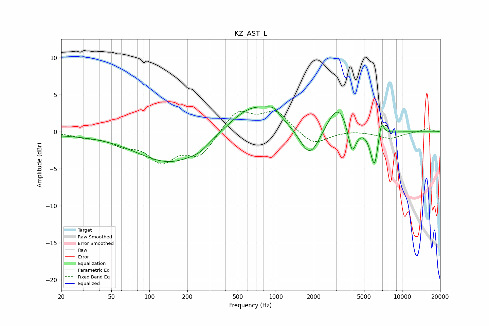

# KZ_AST_L
See [usage instructions](https://github.com/jaakkopasanen/AutoEq#usage) for more options and info.

### Parametric EQs
Apply preamp of -3.5 dB when using parametric equalizer.

|   # | Type    |   Fc (Hz) |    Q |   Gain (dB) |
|-----|---------|-----------|------|-------------|
|   1 | Peaking |        20 | 0.58 |        -0.3 |
|   2 | Peaking |       151 | 0.52 |        -4.3 |
|   3 | Peaking |       251 | 2.08 |        -0.6 |
|   4 | Peaking |       677 | 0.68 |         4.1 |
|   5 | Peaking |       959 | 3.24 |         0.8 |
|   6 | Peaking |      1863 | 1.69 |        -4.5 |
|   7 | Peaking |      3148 | 1.57 |         4.2 |
|   8 | Peaking |      4013 | 4.07 |        -4.3 |
|   9 | Peaking |      6051 | 4.3  |        -5.2 |
|  10 | Peaking |      6833 | 5.87 |         2.6 |

### Fixed Band EQs
When using fixed band (also called graphic) equalizer, apply preamp of **-2.9 dB** (if available) and set gains manually with these parameters.

|   # | Type    |   Fc (Hz) |    Q |   Gain (dB) |
|-----|---------|-----------|------|-------------|
|   1 | Peaking |        31 | 1.41 |        -0.5 |
|   2 | Peaking |        62 | 1.41 |        -1.4 |
|   3 | Peaking |       125 | 1.41 |        -3.6 |
|   4 | Peaking |       250 | 1.41 |        -3.1 |
|   5 | Peaking |       500 | 1.41 |         2.9 |
|   6 | Peaking |      1000 | 1.41 |         2.7 |
|   7 | Peaking |      2000 | 1.41 |        -1.9 |
|   8 | Peaking |      4000 | 1.41 |         0.2 |
|   9 | Peaking |      8000 | 1.41 |        -0.9 |
|  10 | Peaking |     16000 | 1.41 |         0.5 |

### Graphs

