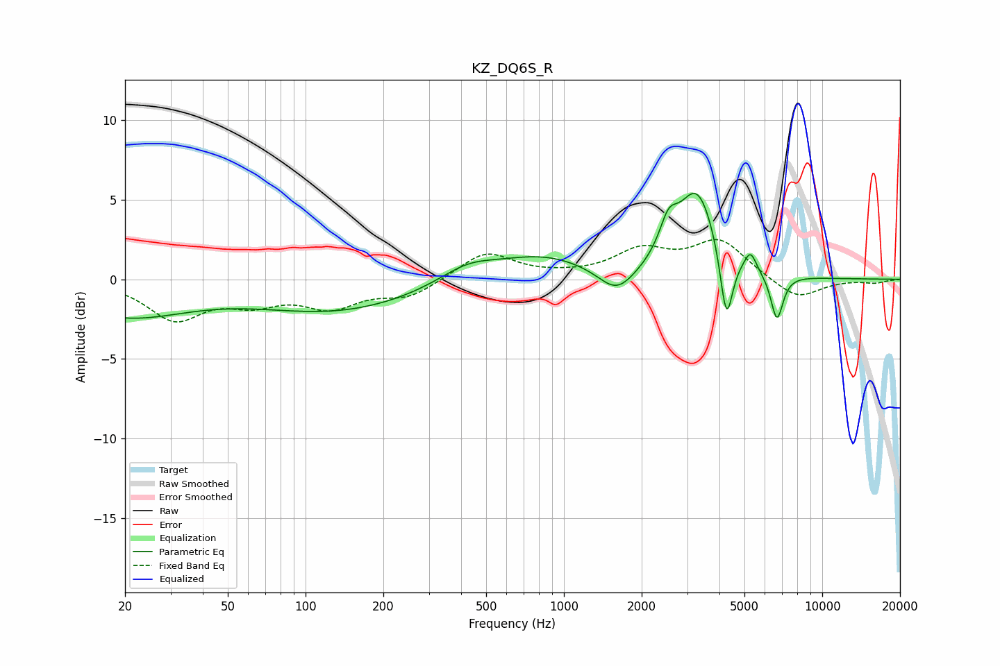

# KZ_DQ6S_R
See [usage instructions](https://github.com/jaakkopasanen/AutoEq#usage) for more options and info.

### Parametric EQs
Apply preamp of -5.5 dB when using parametric equalizer.

|   # | Type    |   Fc (Hz) |    Q |   Gain (dB) |
|-----|---------|-----------|------|-------------|
|   1 | Peaking |        20 | 0.57 |        -2.2 |
|   2 | Peaking |       133 | 0.44 |        -1.9 |
|   3 | Peaking |       423 | 1.25 |         1   |
|   4 | Peaking |       820 | 0.76 |         1.5 |
|   5 | Peaking |      1602 | 1.98 |        -1.7 |
|   6 | Peaking |      2539 | 4.04 |         1.9 |
|   7 | Peaking |      3277 | 1.88 |         5.4 |
|   8 | Peaking |      4258 | 5.8  |        -4.6 |
|   9 | Peaking |      5274 | 6    |         1.2 |
|  10 | Peaking |      6677 | 5.74 |        -2.9 |

### Fixed Band EQs
When using fixed band (also called graphic) equalizer, apply preamp of **-2.6 dB** (if available) and set gains manually with these parameters.

|   # | Type    |   Fc (Hz) |    Q |   Gain (dB) |
|-----|---------|-----------|------|-------------|
|   1 | Peaking |        31 | 1.41 |        -2.4 |
|   2 | Peaking |        62 | 1.41 |        -1.2 |
|   3 | Peaking |       125 | 1.41 |        -1.6 |
|   4 | Peaking |       250 | 1.41 |        -1.1 |
|   5 | Peaking |       500 | 1.41 |         1.7 |
|   6 | Peaking |      1000 | 1.41 |         0.1 |
|   7 | Peaking |      2000 | 1.41 |         1.7 |
|   8 | Peaking |      4000 | 1.41 |         2.4 |
|   9 | Peaking |      8000 | 1.41 |        -1.3 |
|  10 | Peaking |     16000 | 1.41 |        -0.2 |

### Graphs

