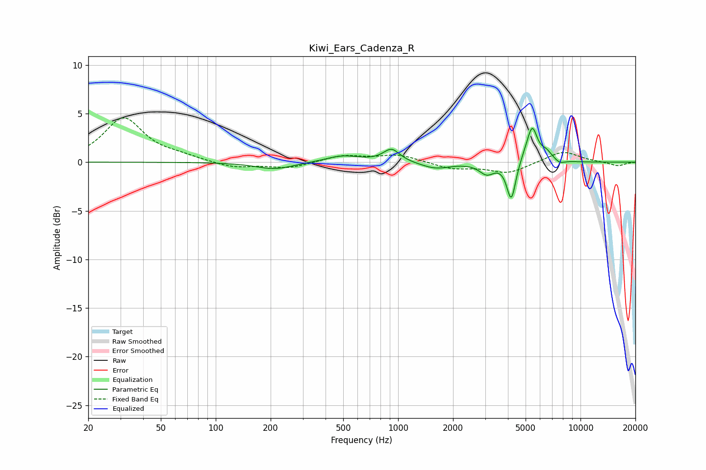

# Kiwi_Ears_Cadenza_R
See [usage instructions](https://github.com/jaakkopasanen/AutoEq#usage) for more options and info.

### Parametric EQs
Apply preamp of -3.6 dB when using parametric equalizer.

|   # | Type    |   Fc (Hz) |    Q |   Gain (dB) |
|-----|---------|-----------|------|-------------|
|   1 | Peaking |       210 | 1.37 |        -0.7 |
|   2 | Peaking |       497 | 1.52 |         0.7 |
|   3 | Peaking |       920 | 3.16 |         1.3 |
|   4 | Peaking |      1605 | 1.8  |        -0.7 |
|   5 | Peaking |      3061 | 3.53 |        -1.1 |
|   6 | Peaking |      4174 | 5.77 |        -4   |
|   7 | Peaking |      4937 | 4.58 |         0.4 |
|   8 | Peaking |      5435 | 4.95 |         3.4 |
|   9 | Peaking |      6483 | 4.07 |         0.9 |
|  10 | Peaking |      7700 | 5.13 |        -0.4 |

### Fixed Band EQs
When using fixed band (also called graphic) equalizer, apply preamp of **-4.7 dB** (if available) and set gains manually with these parameters.

|   # | Type    |   Fc (Hz) |    Q |   Gain (dB) |
|-----|---------|-----------|------|-------------|
|   1 | Peaking |        31 | 1.41 |         4.5 |
|   2 | Peaking |        62 | 1.41 |         0.4 |
|   3 | Peaking |       125 | 1.41 |        -0.6 |
|   4 | Peaking |       250 | 1.41 |        -0.6 |
|   5 | Peaking |       500 | 1.41 |         0.7 |
|   6 | Peaking |      1000 | 1.41 |         0.8 |
|   7 | Peaking |      2000 | 1.41 |        -0.7 |
|   8 | Peaking |      4000 | 1.41 |        -1.1 |
|   9 | Peaking |      8000 | 1.41 |         1.2 |
|  10 | Peaking |     16000 | 1.41 |        -0.4 |

### Graphs

