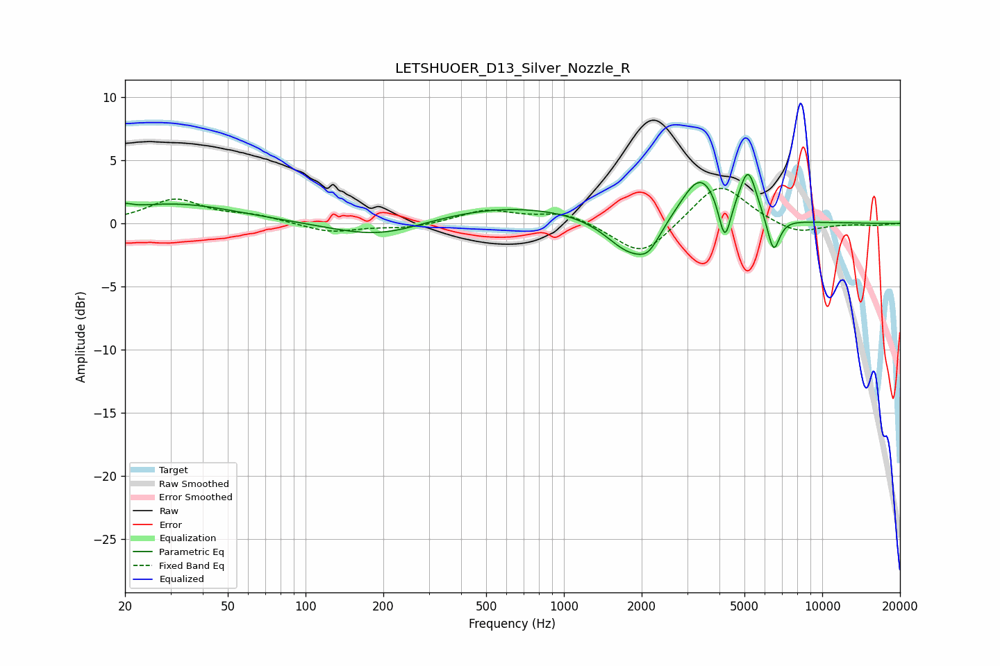

# LETSHUOER_D13_Silver_Nozzle_R
See [usage instructions](https://github.com/jaakkopasanen/AutoEq#usage) for more options and info.

### Parametric EQs
Apply preamp of -4.0 dB when using parametric equalizer.

|   # | Type    |   Fc (Hz) |    Q |   Gain (dB) |
|-----|---------|-----------|------|-------------|
|   1 | Peaking |        20 | 5.42 |         0.4 |
|   2 | Peaking |        31 | 0.58 |         1.6 |
|   3 | Peaking |       195 | 0.77 |        -1.4 |
|   4 | Peaking |       620 | 0.4  |         1.5 |
|   5 | Peaking |      1800 | 1.51 |        -2.9 |
|   6 | Peaking |      2131 | 3.25 |        -1.4 |
|   7 | Peaking |      3373 | 1.88 |         3.9 |
|   8 | Peaking |      4196 | 5.99 |        -3.5 |
|   9 | Peaking |      5165 | 4.14 |         3.8 |
|  10 | Peaking |      6477 | 5.78 |        -2.9 |

### Fixed Band EQs
When using fixed band (also called graphic) equalizer, apply preamp of **-2.9 dB** (if available) and set gains manually with these parameters.

|   # | Type    |   Fc (Hz) |    Q |   Gain (dB) |
|-----|---------|-----------|------|-------------|
|   1 | Peaking |        31 | 1.41 |         1.9 |
|   2 | Peaking |        62 | 1.41 |         0.5 |
|   3 | Peaking |       125 | 1.41 |        -0.7 |
|   4 | Peaking |       250 | 1.41 |        -0.4 |
|   5 | Peaking |       500 | 1.41 |         1   |
|   6 | Peaking |      1000 | 1.41 |         0.9 |
|   7 | Peaking |      2000 | 1.41 |        -2.7 |
|   8 | Peaking |      4000 | 1.41 |         3.3 |
|   9 | Peaking |      8000 | 1.41 |        -0.9 |
|  10 | Peaking |     16000 | 1.41 |        -0.1 |

### Graphs

