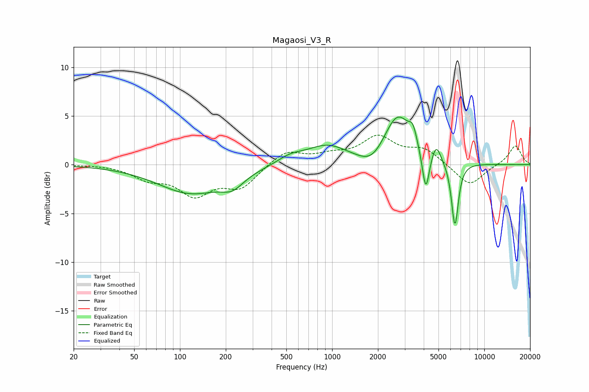

# Magaosi_V3_R
See [usage instructions](https://github.com/jaakkopasanen/AutoEq#usage) for more options and info.

### Parametric EQs
Apply preamp of -5.0 dB when using parametric equalizer.

|   # | Type    |   Fc (Hz) |    Q |   Gain (dB) |
|-----|---------|-----------|------|-------------|
|   1 | Peaking |       118 | 0.65 |        -2.9 |
|   2 | Peaking |       221 | 1.93 |        -1.2 |
|   3 | Peaking |       531 | 1.61 |         0.8 |
|   4 | Peaking |       926 | 1.06 |         1.9 |
|   5 | Peaking |      1842 | 1.63 |        -1.6 |
|   6 | Peaking |      2696 | 1.49 |         5.2 |
|   7 | Peaking |      3395 | 5.79 |         1.4 |
|   8 | Peaking |      4125 | 6    |        -4.3 |
|   9 | Peaking |      4830 | 4.78 |         1.7 |
|  10 | Peaking |      6413 | 6    |        -6.7 |

### Fixed Band EQs
When using fixed band (also called graphic) equalizer, apply preamp of **-3.1 dB** (if available) and set gains manually with these parameters.

|   # | Type    |   Fc (Hz) |    Q |   Gain (dB) |
|-----|---------|-----------|------|-------------|
|   1 | Peaking |        31 | 1.41 |         0   |
|   2 | Peaking |        62 | 1.41 |        -1.3 |
|   3 | Peaking |       125 | 1.41 |        -2.9 |
|   4 | Peaking |       250 | 1.41 |        -2.2 |
|   5 | Peaking |       500 | 1.41 |         1.5 |
|   6 | Peaking |      1000 | 1.41 |         0.8 |
|   7 | Peaking |      2000 | 1.41 |         2.7 |
|   8 | Peaking |      4000 | 1.41 |         1.5 |
|   9 | Peaking |      8000 | 1.41 |        -2.2 |
|  10 | Peaking |     16000 | 1.41 |         2   |

### Graphs

