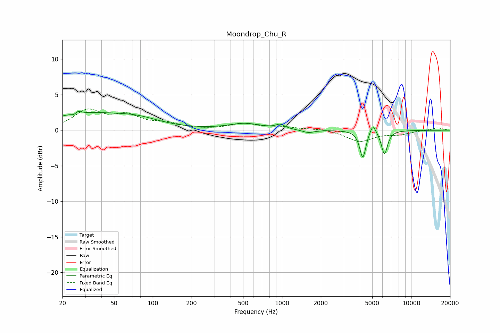

# Moondrop_Chu_R
See [usage instructions](https://github.com/jaakkopasanen/AutoEq#usage) for more options and info.

### Parametric EQs
Apply preamp of -2.7 dB when using parametric equalizer.

|   # | Type    |   Fc (Hz) |    Q |   Gain (dB) |
|-----|---------|-----------|------|-------------|
|   1 | Peaking |        25 | 5.99 |        -2.2 |
|   2 | Peaking |        25 | 5.48 |         2.3 |
|   3 | Peaking |        34 | 0.4  |         2.3 |
|   4 | Peaking |        79 | 0.96 |         0.6 |
|   5 | Peaking |       520 | 1.11 |         0.9 |
|   6 | Peaking |       970 | 4.15 |         0.6 |
|   7 | Peaking |      1600 | 3.07 |        -0.4 |
|   8 | Peaking |      4226 | 6    |        -3.9 |
|   9 | Peaking |      5058 | 6    |         1.4 |
|  10 | Peaking |      6217 | 5.75 |        -3.3 |

### Fixed Band EQs
When using fixed band (also called graphic) equalizer, apply preamp of **-3.1 dB** (if available) and set gains manually with these parameters.

|   # | Type    |   Fc (Hz) |    Q |   Gain (dB) |
|-----|---------|-----------|------|-------------|
|   1 | Peaking |        31 | 1.41 |         2.6 |
|   2 | Peaking |        62 | 1.41 |         1.8 |
|   3 | Peaking |       125 | 1.41 |         0.8 |
|   4 | Peaking |       250 | 1.41 |         0   |
|   5 | Peaking |       500 | 1.41 |         0.9 |
|   6 | Peaking |      1000 | 1.41 |         0.4 |
|   7 | Peaking |      2000 | 1.41 |         0.2 |
|   8 | Peaking |      4000 | 1.41 |        -1.6 |
|   9 | Peaking |      8000 | 1.41 |        -0.5 |
|  10 | Peaking |     16000 | 1.41 |         0.4 |

### Graphs

