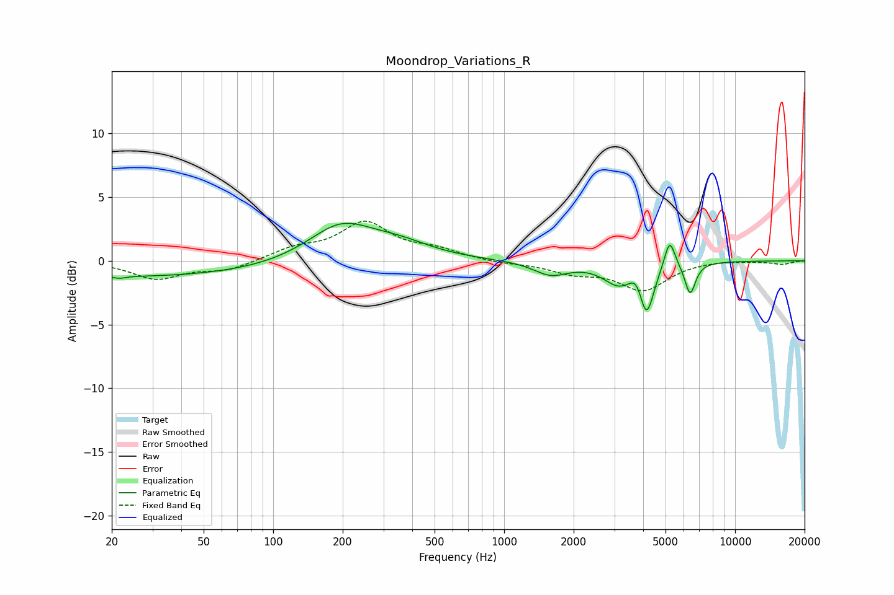

# Moondrop_Variations_R
See [usage instructions](https://github.com/jaakkopasanen/AutoEq#usage) for more options and info.

### Parametric EQs
Apply preamp of -3.0 dB when using parametric equalizer.

|   # | Type    |   Fc (Hz) |    Q |   Gain (dB) |
|-----|---------|-----------|------|-------------|
|   1 | Peaking |        22 | 5.63 |        -0.2 |
|   2 | Peaking |        26 | 0.22 |        -1.2 |
|   3 | Peaking |       196 | 1    |         2.8 |
|   4 | Peaking |       354 | 1    |         1   |
|   5 | Peaking |      1593 | 1.88 |        -1.1 |
|   6 | Peaking |      3139 | 2.08 |        -1.7 |
|   7 | Peaking |      3754 | 4.86 |         1.1 |
|   8 | Peaking |      4135 | 4.49 |        -3.9 |
|   9 | Peaking |      5208 | 5.98 |         2.3 |
|  10 | Peaking |      6393 | 5.99 |        -2.5 |

### Fixed Band EQs
When using fixed band (also called graphic) equalizer, apply preamp of **-3.2 dB** (if available) and set gains manually with these parameters.

|   # | Type    |   Fc (Hz) |    Q |   Gain (dB) |
|-----|---------|-----------|------|-------------|
|   1 | Peaking |        31 | 1.41 |        -1.4 |
|   2 | Peaking |        62 | 1.41 |        -0.7 |
|   3 | Peaking |       125 | 1.41 |         0.9 |
|   4 | Peaking |       250 | 1.41 |         2.9 |
|   5 | Peaking |       500 | 1.41 |         0.7 |
|   6 | Peaking |      1000 | 1.41 |        -0.2 |
|   7 | Peaking |      2000 | 1.41 |        -0.8 |
|   8 | Peaking |      4000 | 1.41 |        -2.2 |
|   9 | Peaking |      8000 | 1.41 |         0.1 |
|  10 | Peaking |     16000 | 1.41 |        -0.3 |

### Graphs

