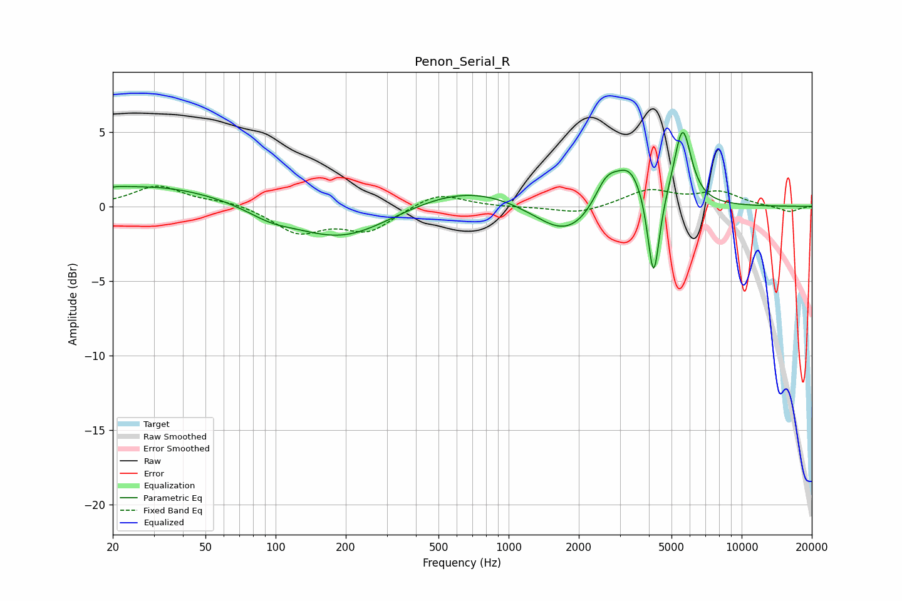

# Penon_Serial_R
See [usage instructions](https://github.com/jaakkopasanen/AutoEq#usage) for more options and info.

### Parametric EQs
Apply preamp of -5.0 dB when using parametric equalizer.

|   # | Type    |   Fc (Hz) |    Q |   Gain (dB) |
|-----|---------|-----------|------|-------------|
|   1 | Peaking |        21 | 2.97 |         0.2 |
|   2 | Peaking |        30 | 0.47 |         1.4 |
|   3 | Peaking |        95 | 1.44 |        -0.6 |
|   4 | Peaking |       192 | 0.68 |        -2.3 |
|   5 | Peaking |       665 | 0.57 |         1.4 |
|   6 | Peaking |      1775 | 1.04 |        -2.4 |
|   7 | Peaking |      2625 | 2.66 |         2   |
|   8 | Peaking |      3324 | 2.18 |         2.6 |
|   9 | Peaking |      4188 | 5.65 |        -6.1 |
|  10 | Peaking |      5576 | 3.73 |         5.2 |

### Fixed Band EQs
When using fixed band (also called graphic) equalizer, apply preamp of **-1.5 dB** (if available) and set gains manually with these parameters.

|   # | Type    |   Fc (Hz) |    Q |   Gain (dB) |
|-----|---------|-----------|------|-------------|
|   1 | Peaking |        31 | 1.41 |         1.4 |
|   2 | Peaking |        62 | 1.41 |         0.3 |
|   3 | Peaking |       125 | 1.41 |        -1.7 |
|   4 | Peaking |       250 | 1.41 |        -1.6 |
|   5 | Peaking |       500 | 1.41 |         1   |
|   6 | Peaking |      1000 | 1.41 |        -0   |
|   7 | Peaking |      2000 | 1.41 |        -0.5 |
|   8 | Peaking |      4000 | 1.41 |         1.1 |
|   9 | Peaking |      8000 | 1.41 |         0.9 |
|  10 | Peaking |     16000 | 1.41 |        -0.4 |

### Graphs

