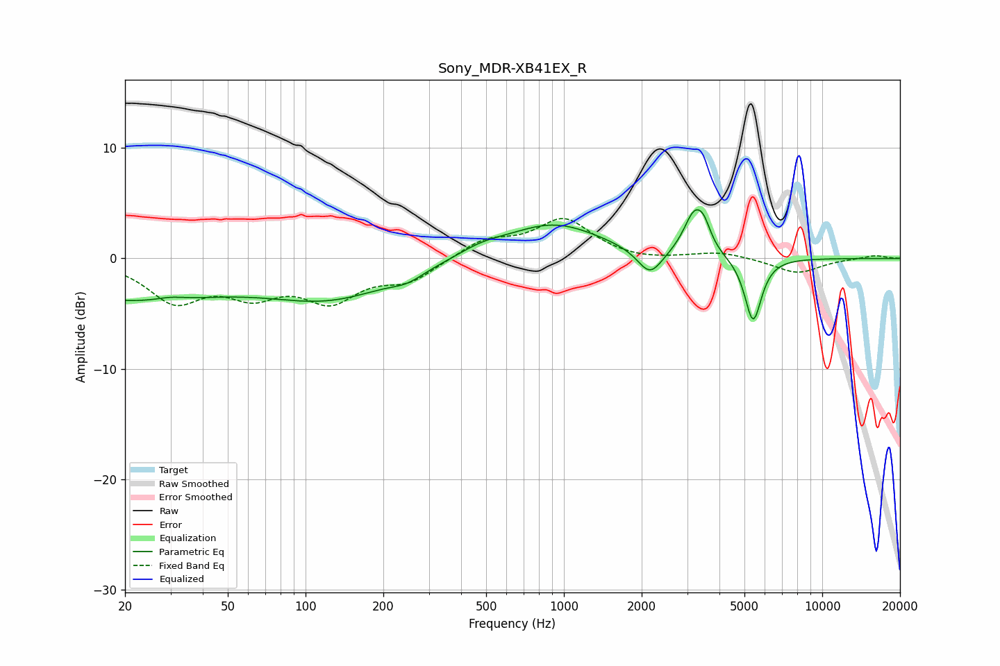

# Sony_MDR-XB41EX_R
See [usage instructions](https://github.com/jaakkopasanen/AutoEq#usage) for more options and info.

### Parametric EQs
Apply preamp of -4.5 dB when using parametric equalizer.

|   # | Type    |   Fc (Hz) |    Q |   Gain (dB) |
|-----|---------|-----------|------|-------------|
|   1 | Peaking |        20 | 0.38 |        -3.6 |
|   2 | Peaking |        30 | 2.67 |         0.3 |
|   3 | Peaking |       125 | 0.57 |        -3.3 |
|   4 | Peaking |       248 | 2.3  |        -0.7 |
|   5 | Peaking |       479 | 1.52 |         0.7 |
|   6 | Peaking |       912 | 0.76 |         3.1 |
|   7 | Peaking |      2154 | 2.93 |        -2.4 |
|   8 | Peaking |      3204 | 3.38 |         3.8 |
|   9 | Peaking |      3493 | 5.49 |         1.3 |
|  10 | Peaking |      5401 | 4.25 |        -5.9 |

### Fixed Band EQs
When using fixed band (also called graphic) equalizer, apply preamp of **-3.7 dB** (if available) and set gains manually with these parameters.

|   # | Type    |   Fc (Hz) |    Q |   Gain (dB) |
|-----|---------|-----------|------|-------------|
|   1 | Peaking |        31 | 1.41 |        -3.6 |
|   2 | Peaking |        62 | 1.41 |        -2.7 |
|   3 | Peaking |       125 | 1.41 |        -3.4 |
|   4 | Peaking |       250 | 1.41 |        -1.9 |
|   5 | Peaking |       500 | 1.41 |         1.6 |
|   6 | Peaking |      1000 | 1.41 |         3.5 |
|   7 | Peaking |      2000 | 1.41 |        -0.3 |
|   8 | Peaking |      4000 | 1.41 |         0.6 |
|   9 | Peaking |      8000 | 1.41 |        -1.4 |
|  10 | Peaking |     16000 | 1.41 |         0.3 |

### Graphs

