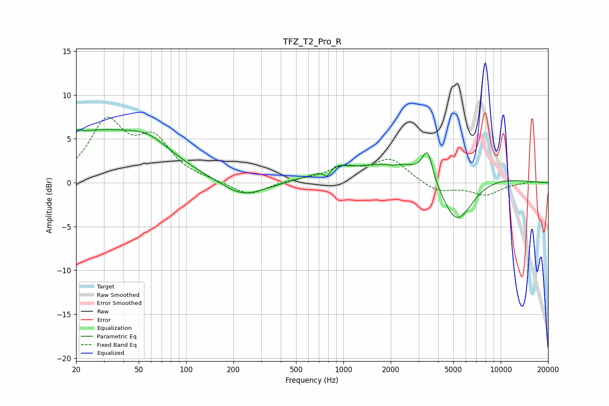

# TFZ_T2_Pro_R
See [usage instructions](https://github.com/jaakkopasanen/AutoEq#usage) for more options and info.

### Parametric EQs
Apply preamp of -6.2 dB when using parametric equalizer.

|   # | Type    |   Fc (Hz) |    Q |   Gain (dB) |
|-----|---------|-----------|------|-------------|
|   1 | Peaking |        20 | 5.98 |         0.4 |
|   2 | Peaking |        26 | 0.36 |         5.7 |
|   3 | Peaking |        58 | 1.08 |         1.6 |
|   4 | Peaking |       228 | 1    |        -1.9 |
|   5 | Peaking |       789 | 5.78 |        -1.2 |
|   6 | Peaking |       842 | 1.85 |         1.3 |
|   7 | Peaking |      2053 | 5.96 |        -0.2 |
|   8 | Peaking |      3332 | 0.36 |         3.2 |
|   9 | Peaking |      3426 | 4.45 |         3.2 |
|  10 | Peaking |      5218 | 1.23 |        -7   |

### Fixed Band EQs
When using fixed band (also called graphic) equalizer, apply preamp of **-7.6 dB** (if available) and set gains manually with these parameters.

|   # | Type    |   Fc (Hz) |    Q |   Gain (dB) |
|-----|---------|-----------|------|-------------|
|   1 | Peaking |        31 | 1.41 |         6.6 |
|   2 | Peaking |        62 | 1.41 |         4.4 |
|   3 | Peaking |       125 | 1.41 |         0.2 |
|   4 | Peaking |       250 | 1.41 |        -1.5 |
|   5 | Peaking |       500 | 1.41 |         0.3 |
|   6 | Peaking |      1000 | 1.41 |         1.5 |
|   7 | Peaking |      2000 | 1.41 |         2.6 |
|   8 | Peaking |      4000 | 1.41 |        -1.1 |
|   9 | Peaking |      8000 | 1.41 |        -1.3 |
|  10 | Peaking |     16000 | 1.41 |         0.2 |

### Graphs

