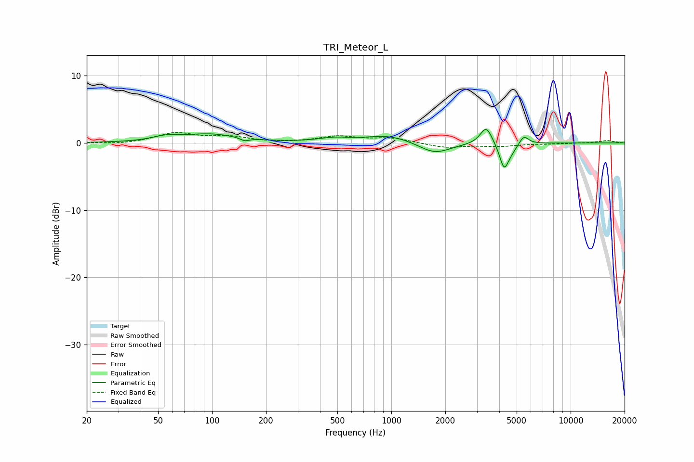

# TRI_Meteor_L
See [usage instructions](https://github.com/jaakkopasanen/AutoEq#usage) for more options and info.

### Parametric EQs
Apply preamp of -2.1 dB when using parametric equalizer.

|   # | Type    |   Fc (Hz) |    Q |   Gain (dB) |
|-----|---------|-----------|------|-------------|
|   1 | Peaking |        55 | 1.87 |         0.7 |
|   2 | Peaking |        98 | 0.93 |         1.2 |
|   3 | Peaking |       152 | 5.86 |        -0.5 |
|   4 | Peaking |       477 | 1.63 |         0.6 |
|   5 | Peaking |       967 | 1.1  |         1.2 |
|   6 | Peaking |      1745 | 1.6  |        -1.7 |
|   7 | Peaking |      3384 | 4.29 |         2.7 |
|   8 | Peaking |      4252 | 5.63 |        -3.5 |
|   9 | Peaking |      4641 | 3.75 |        -0.9 |
|  10 | Peaking |      5479 | 5.34 |         1.4 |

### Fixed Band EQs
When using fixed band (also called graphic) equalizer, apply preamp of **-1.7 dB** (if available) and set gains manually with these parameters.

|   # | Type    |   Fc (Hz) |    Q |   Gain (dB) |
|-----|---------|-----------|------|-------------|
|   1 | Peaking |        31 | 1.41 |        -0.2 |
|   2 | Peaking |        62 | 1.41 |         1.4 |
|   3 | Peaking |       125 | 1.41 |         0.8 |
|   4 | Peaking |       250 | 1.41 |        -0   |
|   5 | Peaking |       500 | 1.41 |         0.9 |
|   6 | Peaking |      1000 | 1.41 |         0.7 |
|   7 | Peaking |      2000 | 1.41 |        -0.7 |
|   8 | Peaking |      4000 | 1.41 |        -0.4 |
|   9 | Peaking |      8000 | 1.41 |        -0.1 |
|  10 | Peaking |     16000 | 1.41 |         0.4 |

### Graphs

