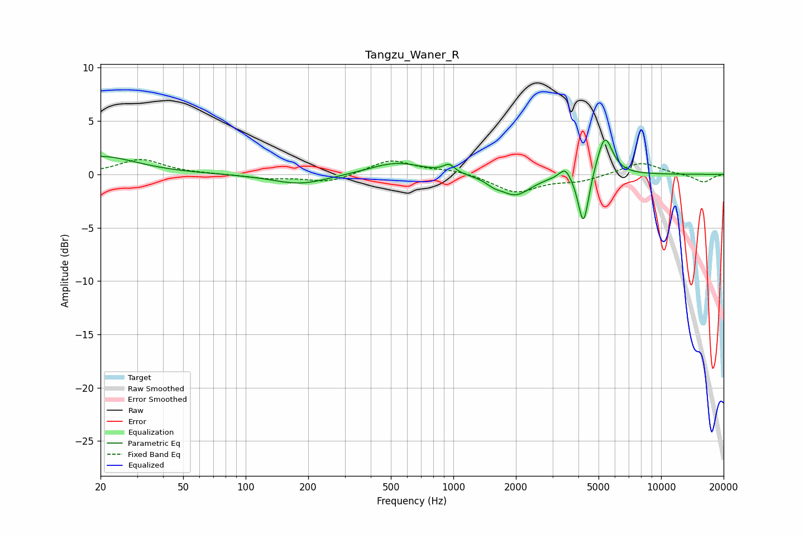

# Tangzu_Waner_R
See [usage instructions](https://github.com/jaakkopasanen/AutoEq#usage) for more options and info.

### Parametric EQs
Apply preamp of -3.3 dB when using parametric equalizer.

|   # | Type    |   Fc (Hz) |    Q |   Gain (dB) |
|-----|---------|-----------|------|-------------|
|   1 | Peaking |        20 | 0.83 |         1.7 |
|   2 | Peaking |       183 | 1.06 |        -1   |
|   3 | Peaking |       525 | 1.11 |         1.1 |
|   4 | Peaking |       644 | 1.5  |         0.1 |
|   5 | Peaking |       952 | 5.17 |         0.8 |
|   6 | Peaking |      1565 | 3.89 |        -0.4 |
|   7 | Peaking |      1991 | 1.88 |        -1.9 |
|   8 | Peaking |      3456 | 5.15 |         1.1 |
|   9 | Peaking |      4230 | 5.51 |        -5.1 |
|  10 | Peaking |      5356 | 3.72 |         3.8 |

### Fixed Band EQs
When using fixed band (also called graphic) equalizer, apply preamp of **-1.5 dB** (if available) and set gains manually with these parameters.

|   # | Type    |   Fc (Hz) |    Q |   Gain (dB) |
|-----|---------|-----------|------|-------------|
|   1 | Peaking |        31 | 1.41 |         1.4 |
|   2 | Peaking |        62 | 1.41 |         0   |
|   3 | Peaking |       125 | 1.41 |        -0.4 |
|   4 | Peaking |       250 | 1.41 |        -0.8 |
|   5 | Peaking |       500 | 1.41 |         1.4 |
|   6 | Peaking |      1000 | 1.41 |         0.4 |
|   7 | Peaking |      2000 | 1.41 |        -1.7 |
|   8 | Peaking |      4000 | 1.41 |        -0.6 |
|   9 | Peaking |      8000 | 1.41 |         1.2 |
|  10 | Peaking |     16000 | 1.41 |        -0.8 |

### Graphs

