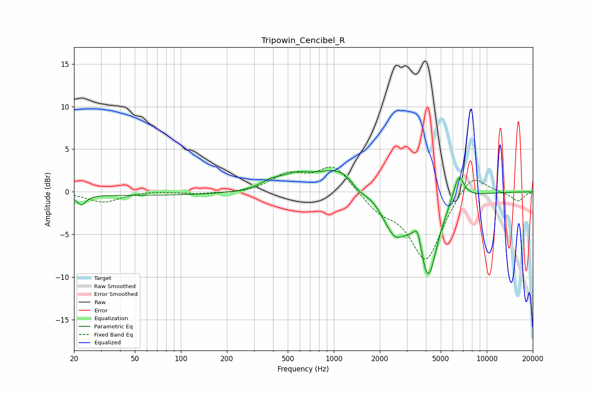

# Tripowin_Cencibel_R
See [usage instructions](https://github.com/jaakkopasanen/AutoEq#usage) for more options and info.

### Parametric EQs
Apply preamp of -2.6 dB when using parametric equalizer.

|   # | Type    |   Fc (Hz) |    Q |   Gain (dB) |
|-----|---------|-----------|------|-------------|
|   1 | Peaking |        22 | 5    |        -1.2 |
|   2 | Peaking |        56 | 0.18 |        -0.4 |
|   3 | Peaking |       391 | 2    |         0.8 |
|   4 | Peaking |       564 | 1.5  |         1.3 |
|   5 | Peaking |      1137 | 0.9  |         3   |
|   6 | Peaking |      1460 | 2.48 |        -1.2 |
|   7 | Peaking |      2496 | 1.69 |        -4.7 |
|   8 | Peaking |      3538 | 5.62 |         2.4 |
|   9 | Peaking |      4136 | 2.31 |        -9.5 |
|  10 | Peaking |      6548 | 3.74 |         3.2 |

### Fixed Band EQs
When using fixed band (also called graphic) equalizer, apply preamp of **-3.0 dB** (if available) and set gains manually with these parameters.

|   # | Type    |   Fc (Hz) |    Q |   Gain (dB) |
|-----|---------|-----------|------|-------------|
|   1 | Peaking |        31 | 1.41 |        -1.2 |
|   2 | Peaking |        62 | 1.41 |         0.1 |
|   3 | Peaking |       125 | 1.41 |        -0.2 |
|   4 | Peaking |       250 | 1.41 |        -0.2 |
|   5 | Peaking |       500 | 1.41 |         1.9 |
|   6 | Peaking |      1000 | 1.41 |         3.1 |
|   7 | Peaking |      2000 | 1.41 |        -1.9 |
|   8 | Peaking |      4000 | 1.41 |        -8   |
|   9 | Peaking |      8000 | 1.41 |         2.6 |
|  10 | Peaking |     16000 | 1.41 |        -1.1 |

### Graphs

