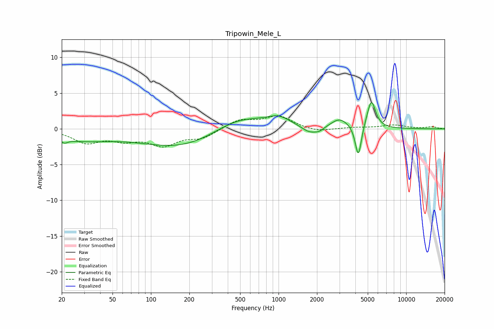

# Tripowin_Mele_L
See [usage instructions](https://github.com/jaakkopasanen/AutoEq#usage) for more options and info.

### Parametric EQs
Apply preamp of -3.8 dB when using parametric equalizer.

|   # | Type    |   Fc (Hz) |    Q |   Gain (dB) |
|-----|---------|-----------|------|-------------|
|   1 | Peaking |        21 | 5.69 |        -0.5 |
|   2 | Peaking |        28 | 0.57 |        -1.4 |
|   3 | Peaking |       187 | 0.42 |        -2.8 |
|   4 | Peaking |       471 | 0.66 |         2.4 |
|   5 | Peaking |      1003 | 1.5  |         1.3 |
|   6 | Peaking |      1744 | 2.29 |        -0.9 |
|   7 | Peaking |      2085 | 3.74 |        -0.5 |
|   8 | Peaking |      3014 | 2.1  |         1.4 |
|   9 | Peaking |      4217 | 5.93 |        -4.5 |
|  10 | Peaking |      5333 | 4.17 |         4   |

### Fixed Band EQs
When using fixed band (also called graphic) equalizer, apply preamp of **-1.9 dB** (if available) and set gains manually with these parameters.

|   # | Type    |   Fc (Hz) |    Q |   Gain (dB) |
|-----|---------|-----------|------|-------------|
|   1 | Peaking |        31 | 1.41 |        -1.8 |
|   2 | Peaking |        62 | 1.41 |        -1.3 |
|   3 | Peaking |       125 | 1.41 |        -2.1 |
|   4 | Peaking |       250 | 1.41 |        -1.2 |
|   5 | Peaking |       500 | 1.41 |         1.3 |
|   6 | Peaking |      1000 | 1.41 |         1.7 |
|   7 | Peaking |      2000 | 1.41 |        -0.5 |
|   8 | Peaking |      4000 | 1.41 |         0.2 |
|   9 | Peaking |      8000 | 1.41 |         0.5 |
|  10 | Peaking |     16000 | 1.41 |         0.3 |

### Graphs

