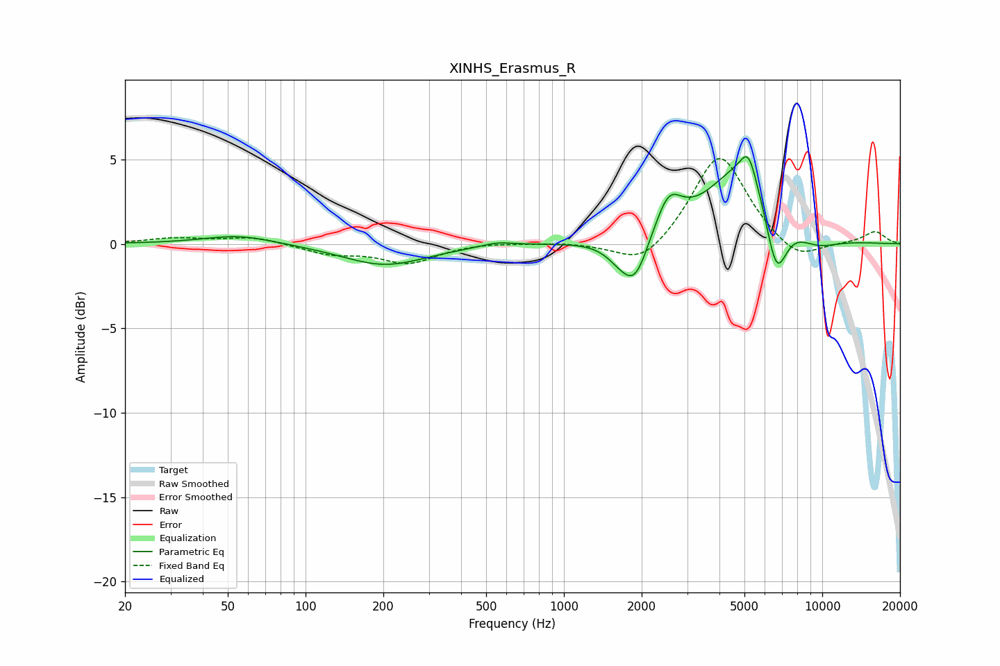

# XINHS_Erasmus_R
See [usage instructions](https://github.com/jaakkopasanen/AutoEq#usage) for more options and info.

### Parametric EQs
Apply preamp of -5.3 dB when using parametric equalizer.

|   # | Type    |   Fc (Hz) |    Q |   Gain (dB) |
|-----|---------|-----------|------|-------------|
|   1 | Peaking |        55 | 1.03 |         0.5 |
|   2 | Peaking |       202 | 0.87 |        -1.3 |
|   3 | Peaking |       552 | 2.19 |         0.3 |
|   4 | Peaking |      1635 | 2.64 |        -0.7 |
|   5 | Peaking |      1886 | 2.77 |        -2.5 |
|   6 | Peaking |      2543 | 2.78 |         2.2 |
|   7 | Peaking |      5009 | 0.99 |         4.8 |
|   8 | Peaking |      5176 | 4.74 |         1.5 |
|   9 | Peaking |      6637 | 3.13 |        -4.2 |
|  10 | Peaking |      9356 | 1.35 |        -0.9 |

### Fixed Band EQs
When using fixed band (also called graphic) equalizer, apply preamp of **-5.2 dB** (if available) and set gains manually with these parameters.

|   # | Type    |   Fc (Hz) |    Q |   Gain (dB) |
|-----|---------|-----------|------|-------------|
|   1 | Peaking |        31 | 1.41 |         0.3 |
|   2 | Peaking |        62 | 1.41 |         0.4 |
|   3 | Peaking |       125 | 1.41 |        -0.6 |
|   4 | Peaking |       250 | 1.41 |        -1.1 |
|   5 | Peaking |       500 | 1.41 |         0.1 |
|   6 | Peaking |      1000 | 1.41 |         0.1 |
|   7 | Peaking |      2000 | 1.41 |        -1.5 |
|   8 | Peaking |      4000 | 1.41 |         5.5 |
|   9 | Peaking |      8000 | 1.41 |        -1.2 |
|  10 | Peaking |     16000 | 1.41 |         0.7 |

### Graphs

