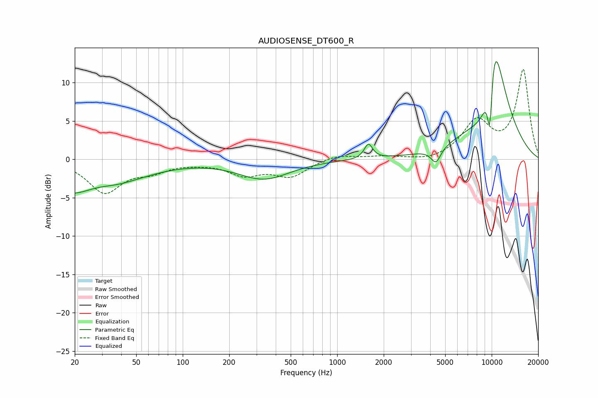

# AUDIOSENSE_DT600_R
See [usage instructions](https://github.com/jaakkopasanen/AutoEq#usage) for more options and info.

### Parametric EQs
Apply preamp of -12.8 dB when using parametric equalizer.

|   # | Type    |   Fc (Hz) |    Q |   Gain (dB) |
|-----|---------|-----------|------|-------------|
|   1 | Peaking |        23 | 0.51 |        -5.4 |
|   2 | Peaking |        27 | 1.19 |         1.5 |
|   3 | Peaking |       336 | 0.84 |        -2.5 |
|   4 | Peaking |      1593 | 5.37 |         1.9 |
|   5 | Peaking |      4357 | 4.38 |        -2   |
|   6 | Peaking |      8897 | 1.6  |        -7.8 |
|   7 | Peaking |      9731 | 5.8  |       -11.8 |
|   8 | Peaking |     10000 | 1.24 |        15.3 |
|   9 | Peaking |     10000 | 1.57 |         4.9 |
|  10 | Peaking |     10000 | 3.32 |         3.5 |

### Fixed Band EQs
When using fixed band (also called graphic) equalizer, apply preamp of **-11.8 dB** (if available) and set gains manually with these parameters.

|   # | Type    |   Fc (Hz) |    Q |   Gain (dB) |
|-----|---------|-----------|------|-------------|
|   1 | Peaking |        31 | 1.41 |        -4.2 |
|   2 | Peaking |        62 | 1.41 |        -1.3 |
|   3 | Peaking |       125 | 1.41 |        -0.2 |
|   4 | Peaking |       250 | 1.41 |        -1.8 |
|   5 | Peaking |       500 | 1.41 |        -2.1 |
|   6 | Peaking |      1000 | 1.41 |         0.7 |
|   7 | Peaking |      2000 | 1.41 |         0.3 |
|   8 | Peaking |      4000 | 1.41 |        -0.4 |
|   9 | Peaking |      8000 | 1.41 |         4.7 |
|  10 | Peaking |     16000 | 1.41 |        11.6 |

### Graphs

