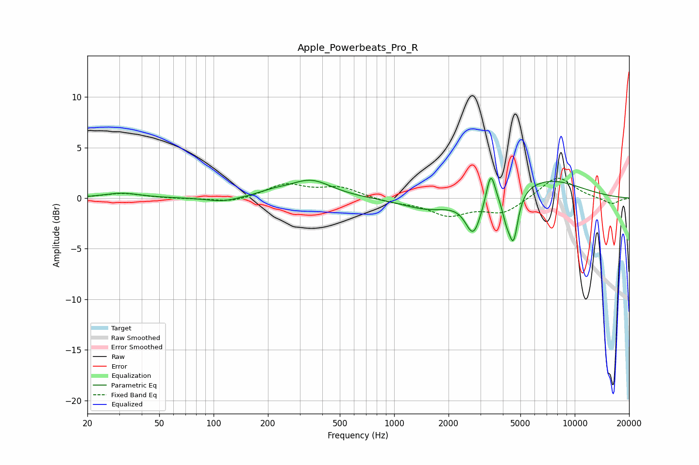

# Apple_Powerbeats_Pro_R
See [usage instructions](https://github.com/jaakkopasanen/AutoEq#usage) for more options and info.

### Parametric EQs
Apply preamp of -2.1 dB when using parametric equalizer.

|   # | Type    |   Fc (Hz) |    Q |   Gain (dB) |
|-----|---------|-----------|------|-------------|
|   1 | Peaking |        31 | 1.45 |         0.5 |
|   2 | Peaking |       112 | 1.6  |        -0.5 |
|   3 | Peaking |       213 | 1.69 |         0.4 |
|   4 | Peaking |       346 | 1.21 |         1.7 |
|   5 | Peaking |      1527 | 1    |        -1.1 |
|   6 | Peaking |      2747 | 3.28 |        -3.5 |
|   7 | Peaking |      3428 | 5.86 |         3.1 |
|   8 | Peaking |      4189 | 5.94 |        -1.8 |
|   9 | Peaking |      4583 | 5.71 |        -4.5 |
|  10 | Peaking |      7063 | 0.7  |         1.9 |

### Fixed Band EQs
When using fixed band (also called graphic) equalizer, apply preamp of **-2.1 dB** (if available) and set gains manually with these parameters.

|   # | Type    |   Fc (Hz) |    Q |   Gain (dB) |
|-----|---------|-----------|------|-------------|
|   1 | Peaking |        31 | 1.41 |         0.5 |
|   2 | Peaking |        62 | 1.41 |        -0   |
|   3 | Peaking |       125 | 1.41 |        -0.5 |
|   4 | Peaking |       250 | 1.41 |         1.3 |
|   5 | Peaking |       500 | 1.41 |         1   |
|   6 | Peaking |      1000 | 1.41 |        -0.4 |
|   7 | Peaking |      2000 | 1.41 |        -1.6 |
|   8 | Peaking |      4000 | 1.41 |        -1.4 |
|   9 | Peaking |      8000 | 1.41 |         2.2 |
|  10 | Peaking |     16000 | 1.41 |        -0.6 |

### Graphs

