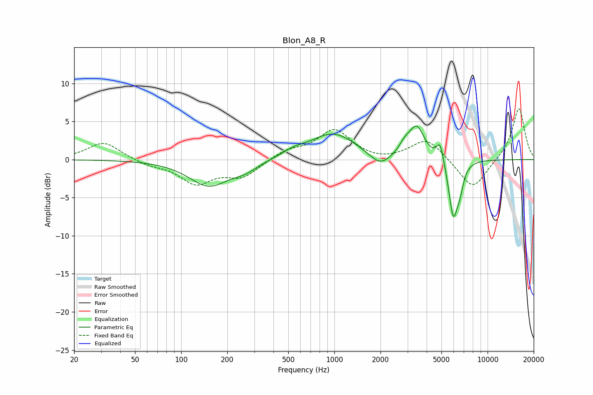

# Blon_A8_R
See [usage instructions](https://github.com/jaakkopasanen/AutoEq#usage) for more options and info.

### Parametric EQs
Apply preamp of -4.5 dB when using parametric equalizer.

|   # | Type    |   Fc (Hz) |    Q |   Gain (dB) |
|-----|---------|-----------|------|-------------|
|   1 | Peaking |       152 | 1.09 |        -3.4 |
|   2 | Peaking |       262 | 1.75 |        -1   |
|   3 | Peaking |       541 | 2.05 |         0.6 |
|   4 | Peaking |       981 | 0.93 |         3.5 |
|   5 | Peaking |      1986 | 2.02 |        -1.7 |
|   6 | Peaking |      2876 | 3.75 |         1.2 |
|   7 | Peaking |      3451 | 2.81 |         4.1 |
|   8 | Peaking |      4903 | 6    |         2.6 |
|   9 | Peaking |      5972 | 4.58 |        -7.4 |
|  10 | Peaking |      6600 | 6    |        -2.1 |

### Fixed Band EQs
When using fixed band (also called graphic) equalizer, apply preamp of **-6.8 dB** (if available) and set gains manually with these parameters.

|   # | Type    |   Fc (Hz) |    Q |   Gain (dB) |
|-----|---------|-----------|------|-------------|
|   1 | Peaking |        31 | 1.41 |         2.3 |
|   2 | Peaking |        62 | 1.41 |        -0.6 |
|   3 | Peaking |       125 | 1.41 |        -3   |
|   4 | Peaking |       250 | 1.41 |        -2.2 |
|   5 | Peaking |       500 | 1.41 |         1.1 |
|   6 | Peaking |      1000 | 1.41 |         3.8 |
|   7 | Peaking |      2000 | 1.41 |        -0.4 |
|   8 | Peaking |      4000 | 1.41 |         2.8 |
|   9 | Peaking |      8000 | 1.41 |        -4.1 |
|  10 | Peaking |     16000 | 1.41 |         6.9 |

### Graphs

