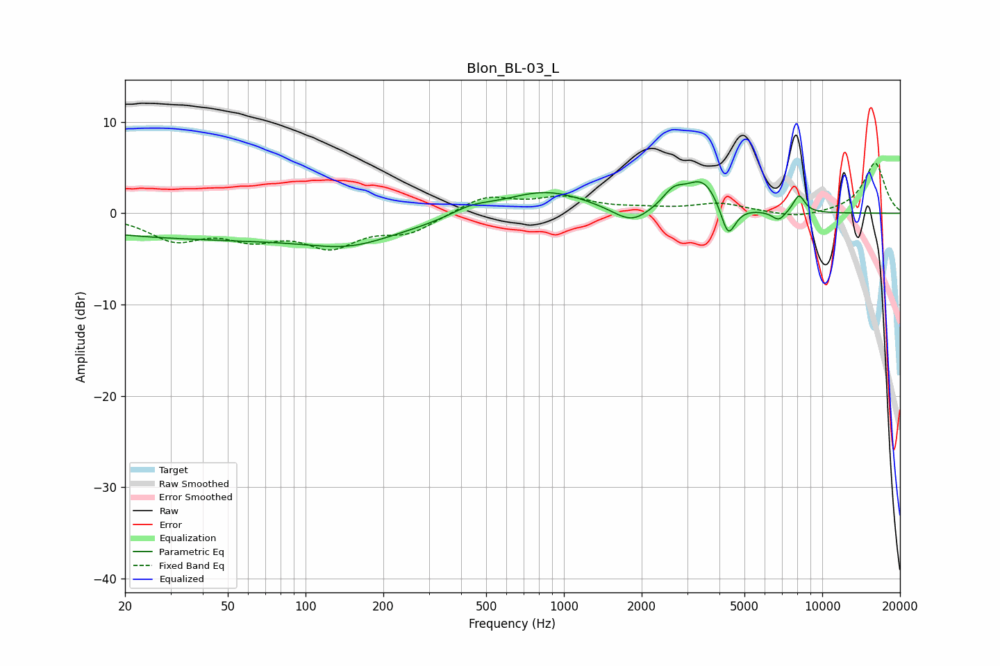

# Blon_BL-03_L
See [usage instructions](https://github.com/jaakkopasanen/AutoEq#usage) for more options and info.

### Parametric EQs
Apply preamp of -3.5 dB when using parametric equalizer.

|   # | Type    |   Fc (Hz) |    Q |   Gain (dB) |
|-----|---------|-----------|------|-------------|
|   1 | Peaking |        56 | 0.18 |        -2.8 |
|   2 | Peaking |       148 | 0.94 |        -1.3 |
|   3 | Peaking |       436 | 1.73 |         0.9 |
|   4 | Peaking |       843 | 0.84 |         2.6 |
|   5 | Peaking |      1828 | 1.96 |        -1.8 |
|   6 | Peaking |      2656 | 3.22 |         1.8 |
|   7 | Peaking |      3446 | 2.13 |         3.5 |
|   8 | Peaking |      4321 | 4.9  |        -3.8 |
|   9 | Peaking |      6784 | 5.23 |        -1.1 |
|  10 | Peaking |      8129 | 5.81 |         2   |

### Fixed Band EQs
When using fixed band (also called graphic) equalizer, apply preamp of **-5.6 dB** (if available) and set gains manually with these parameters.

|   # | Type    |   Fc (Hz) |    Q |   Gain (dB) |
|-----|---------|-----------|------|-------------|
|   1 | Peaking |        31 | 1.41 |        -2.7 |
|   2 | Peaking |        62 | 1.41 |        -2.2 |
|   3 | Peaking |       125 | 1.41 |        -3.2 |
|   4 | Peaking |       250 | 1.41 |        -1.9 |
|   5 | Peaking |       500 | 1.41 |         1.9 |
|   6 | Peaking |      1000 | 1.41 |         1.6 |
|   7 | Peaking |      2000 | 1.41 |         0.4 |
|   8 | Peaking |      4000 | 1.41 |         1   |
|   9 | Peaking |      8000 | 1.41 |        -0.6 |
|  10 | Peaking |     16000 | 1.41 |         5.5 |

### Graphs

