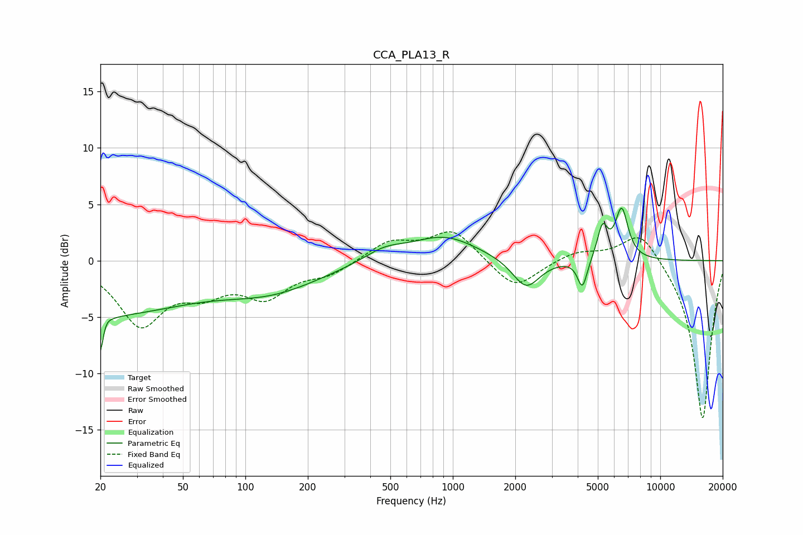

# CCA_PLA13_R
See [usage instructions](https://github.com/jaakkopasanen/AutoEq#usage) for more options and info.

### Parametric EQs
Apply preamp of -4.8 dB when using parametric equalizer.

|   # | Type    |   Fc (Hz) |    Q |   Gain (dB) |
|-----|---------|-----------|------|-------------|
|   1 | Peaking |        20 | 5.98 |        -5.7 |
|   2 | Peaking |        20 | 0.32 |        -4.6 |
|   3 | Peaking |        21 | 5.94 |         2.8 |
|   4 | Peaking |       135 | 0.58 |        -2.3 |
|   5 | Peaking |       466 | 1.43 |         1   |
|   6 | Peaking |       909 | 0.89 |         2.2 |
|   7 | Peaking |      2256 | 2.14 |        -2.7 |
|   8 | Peaking |      4215 | 6    |        -2.6 |
|   9 | Peaking |      5269 | 5.57 |         2.8 |
|  10 | Peaking |      6518 | 4.41 |         4.4 |

### Fixed Band EQs
When using fixed band (also called graphic) equalizer, apply preamp of **-2.7 dB** (if available) and set gains manually with these parameters.

|   # | Type    |   Fc (Hz) |    Q |   Gain (dB) |
|-----|---------|-----------|------|-------------|
|   1 | Peaking |        31 | 1.41 |        -5.4 |
|   2 | Peaking |        62 | 1.41 |        -2.2 |
|   3 | Peaking |       125 | 1.41 |        -2.9 |
|   4 | Peaking |       250 | 1.41 |        -1.1 |
|   5 | Peaking |       500 | 1.41 |         1.7 |
|   6 | Peaking |      1000 | 1.41 |         2.7 |
|   7 | Peaking |      2000 | 1.41 |        -2.6 |
|   8 | Peaking |      4000 | 1.41 |         0.8 |
|   9 | Peaking |      8000 | 1.41 |         2.9 |
|  10 | Peaking |     16000 | 1.41 |       -14.2 |

### Graphs

