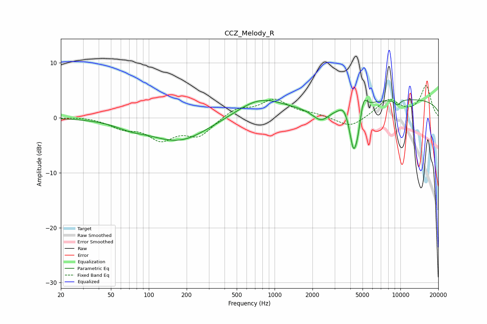

# CCZ_Melody_R
See [usage instructions](https://github.com/jaakkopasanen/AutoEq#usage) for more options and info.

### Parametric EQs
Apply preamp of -3.4 dB when using parametric equalizer.

|   # | Type    |   Fc (Hz) |    Q |   Gain (dB) |
|-----|---------|-----------|------|-------------|
|   1 | Peaking |        71 | 1.22 |        -0.9 |
|   2 | Peaking |       173 | 0.61 |        -4.3 |
|   3 | Peaking |       764 | 0.76 |         3.4 |
|   4 | Peaking |      2345 | 2    |        -2.6 |
|   5 | Peaking |      3541 | 4.38 |         1.1 |
|   6 | Peaking |      4235 | 4.4  |        -7.3 |
|   7 | Peaking |      4583 | 4.69 |        -2.8 |
|   8 | Peaking |      5096 | 5.67 |         2.9 |
|   9 | Peaking |      9484 | 5.39 |        -1   |
|  10 | Peaking |     10000 | 0.18 |         3.4 |

### Fixed Band EQs
When using fixed band (also called graphic) equalizer, apply preamp of **-5.9 dB** (if available) and set gains manually with these parameters.

|   # | Type    |   Fc (Hz) |    Q |   Gain (dB) |
|-----|---------|-----------|------|-------------|
|   1 | Peaking |        31 | 1.41 |         0.2 |
|   2 | Peaking |        62 | 1.41 |        -1.6 |
|   3 | Peaking |       125 | 1.41 |        -3.6 |
|   4 | Peaking |       250 | 1.41 |        -3.1 |
|   5 | Peaking |       500 | 1.41 |         1.7 |
|   6 | Peaking |      1000 | 1.41 |         3.1 |
|   7 | Peaking |      2000 | 1.41 |         0.6 |
|   8 | Peaking |      4000 | 1.41 |        -1.9 |
|   9 | Peaking |      8000 | 1.41 |         3.2 |
|  10 | Peaking |     16000 | 1.41 |         5.7 |

### Graphs

