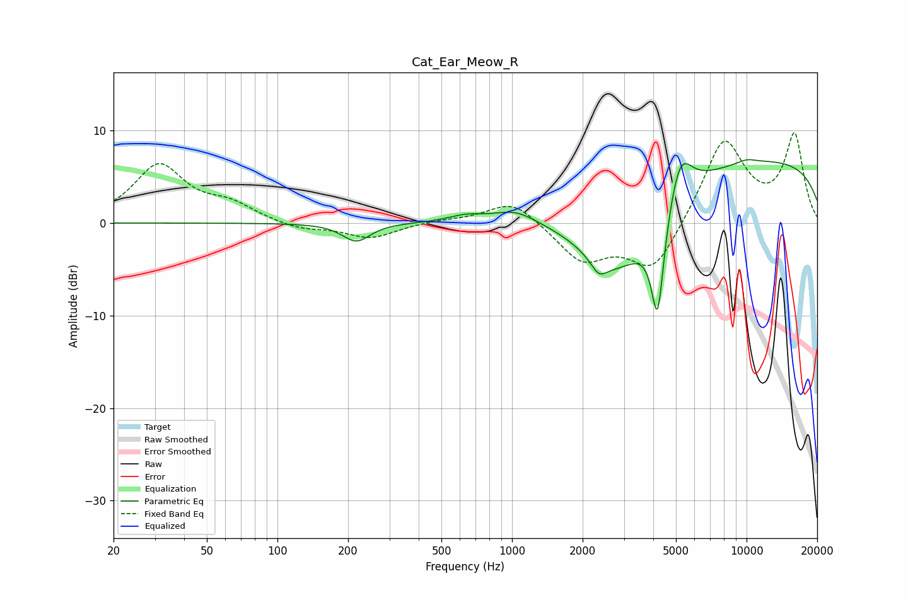

# Cat_Ear_Meow_R
See [usage instructions](https://github.com/jaakkopasanen/AutoEq#usage) for more options and info.

### Parametric EQs
Apply preamp of -6.9 dB when using parametric equalizer.

|   # | Type    |   Fc (Hz) |    Q |   Gain (dB) |
|-----|---------|-----------|------|-------------|
|   1 | Peaking |       217 | 2.41 |        -2   |
|   2 | Peaking |       636 | 1.92 |         0.7 |
|   3 | Peaking |      1033 | 1.54 |         1.4 |
|   4 | Peaking |      2342 | 4.21 |        -1.5 |
|   5 | Peaking |      2689 | 0.87 |        -6.8 |
|   6 | Peaking |      3523 | 0.97 |        -2.4 |
|   7 | Peaking |      4174 | 5.05 |       -10.9 |
|   8 | Peaking |      5194 | 2.74 |         5.4 |
|   9 | Peaking |      9985 | 0.18 |         7   |
|  10 | Peaking |     10000 | 2.87 |         0.4 |

### Fixed Band EQs
When using fixed band (also called graphic) equalizer, apply preamp of **-9.8 dB** (if available) and set gains manually with these parameters.

|   # | Type    |   Fc (Hz) |    Q |   Gain (dB) |
|-----|---------|-----------|------|-------------|
|   1 | Peaking |        31 | 1.41 |         6.1 |
|   2 | Peaking |        62 | 1.41 |         1.7 |
|   3 | Peaking |       125 | 1.41 |        -0.8 |
|   4 | Peaking |       250 | 1.41 |        -1.6 |
|   5 | Peaking |       500 | 1.41 |         0.3 |
|   6 | Peaking |      1000 | 1.41 |         2.6 |
|   7 | Peaking |      2000 | 1.41 |        -4   |
|   8 | Peaking |      4000 | 1.41 |        -5.4 |
|   9 | Peaking |      8000 | 1.41 |         9.2 |
|  10 | Peaking |     16000 | 1.41 |         9.3 |

### Graphs

