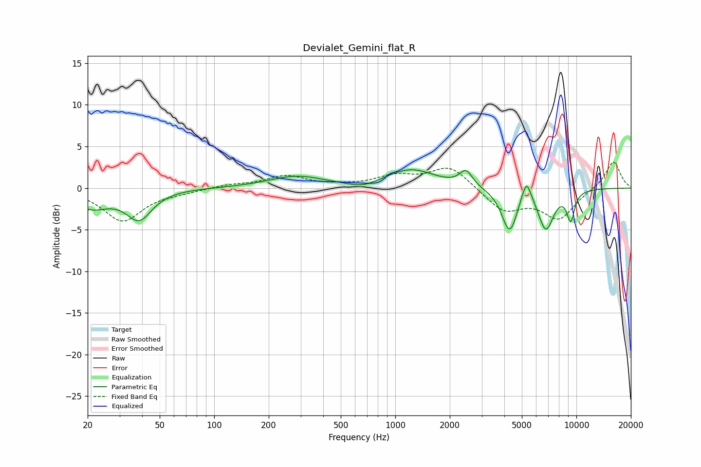

# Devialet_Gemini_flat_R
See [usage instructions](https://github.com/jaakkopasanen/AutoEq#usage) for more options and info.

### Parametric EQs
Apply preamp of -2.3 dB when using parametric equalizer.

|   # | Type    |   Fc (Hz) |    Q |   Gain (dB) |
|-----|---------|-----------|------|-------------|
|   1 | Peaking |        21 | 1.42 |        -2.2 |
|   2 | Peaking |        38 | 2.02 |        -3.5 |
|   3 | Peaking |       285 | 0.93 |         1.4 |
|   4 | Peaking |       663 | 1.71 |        -0.7 |
|   5 | Peaking |      1214 | 1.04 |         2.2 |
|   6 | Peaking |      2459 | 4.05 |         1.8 |
|   7 | Peaking |      4278 | 3.25 |        -5.2 |
|   8 | Peaking |      5294 | 5.18 |         2.8 |
|   9 | Peaking |      6792 | 3.19 |        -4.7 |
|  10 | Peaking |      9301 | 5.96 |        -3.4 |

### Fixed Band EQs
When using fixed band (also called graphic) equalizer, apply preamp of **-3.2 dB** (if available) and set gains manually with these parameters.

|   # | Type    |   Fc (Hz) |    Q |   Gain (dB) |
|-----|---------|-----------|------|-------------|
|   1 | Peaking |        31 | 1.41 |        -3.9 |
|   2 | Peaking |        62 | 1.41 |        -0.4 |
|   3 | Peaking |       125 | 1.41 |         0.4 |
|   4 | Peaking |       250 | 1.41 |         1.4 |
|   5 | Peaking |       500 | 1.41 |         0.2 |
|   6 | Peaking |      1000 | 1.41 |         1.3 |
|   7 | Peaking |      2000 | 1.41 |         2.6 |
|   8 | Peaking |      4000 | 1.41 |        -2.7 |
|   9 | Peaking |      8000 | 1.41 |        -3.6 |
|  10 | Peaking |     16000 | 1.41 |         3.3 |

### Graphs

