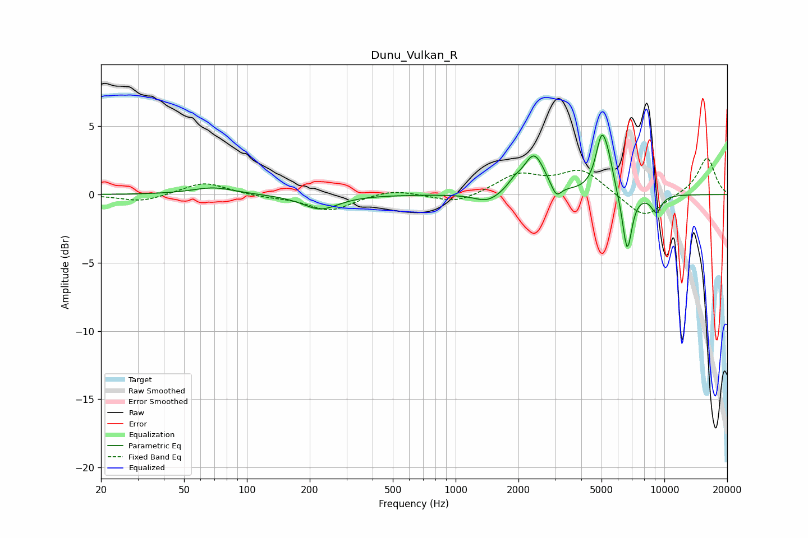

# Dunu_Vulkan_R
See [usage instructions](https://github.com/jaakkopasanen/AutoEq#usage) for more options and info.

### Parametric EQs
Apply preamp of -4.5 dB when using parametric equalizer.

|   # | Type    |   Fc (Hz) |    Q |   Gain (dB) |
|-----|---------|-----------|------|-------------|
|   1 | Peaking |        69 | 1.39 |         0.5 |
|   2 | Peaking |       225 | 1.65 |        -1.1 |
|   3 | Peaking |      1421 | 2.31 |        -0.7 |
|   4 | Peaking |      1917 | 4.33 |         0.5 |
|   5 | Peaking |      2376 | 2.84 |         2.9 |
|   6 | Peaking |      3035 | 5.91 |        -1   |
|   7 | Peaking |      5020 | 4.71 |         4.1 |
|   8 | Peaking |      5444 | 6    |         1.1 |
|   9 | Peaking |      6637 | 5.99 |        -4.4 |
|  10 | Peaking |      9151 | 5.1  |        -1.3 |

### Fixed Band EQs
When using fixed band (also called graphic) equalizer, apply preamp of **-2.8 dB** (if available) and set gains manually with these parameters.

|   # | Type    |   Fc (Hz) |    Q |   Gain (dB) |
|-----|---------|-----------|------|-------------|
|   1 | Peaking |        31 | 1.41 |        -0.5 |
|   2 | Peaking |        62 | 1.41 |         0.9 |
|   3 | Peaking |       125 | 1.41 |        -0.2 |
|   4 | Peaking |       250 | 1.41 |        -1.2 |
|   5 | Peaking |       500 | 1.41 |         0.4 |
|   6 | Peaking |      1000 | 1.41 |        -0.7 |
|   7 | Peaking |      2000 | 1.41 |         1.4 |
|   8 | Peaking |      4000 | 1.41 |         1.8 |
|   9 | Peaking |      8000 | 1.41 |        -1.8 |
|  10 | Peaking |     16000 | 1.41 |         2.7 |

### Graphs

