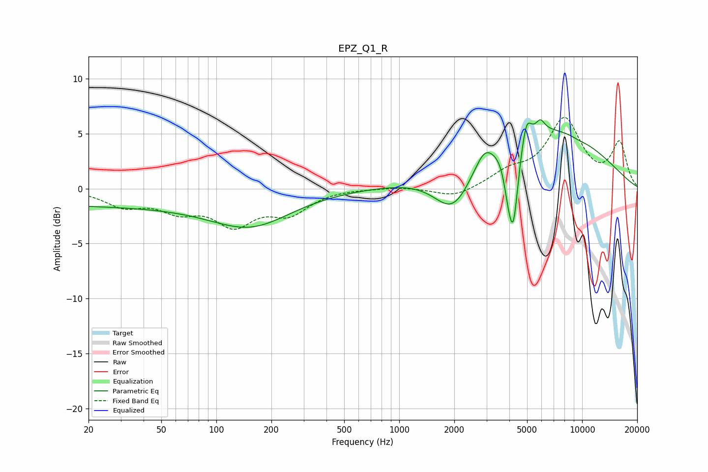

# EPZ_Q1_R
See [usage instructions](https://github.com/jaakkopasanen/AutoEq#usage) for more options and info.

### Parametric EQs
Apply preamp of -6.4 dB when using parametric equalizer.

|   # | Type    |   Fc (Hz) |    Q |   Gain (dB) |
|-----|---------|-----------|------|-------------|
|   1 | Peaking |        26 | 0.18 |        -1.5 |
|   2 | Peaking |       157 | 0.65 |        -2.8 |
|   3 | Peaking |      1982 | 1.31 |        -4.5 |
|   4 | Peaking |      2911 | 3.05 |         1.3 |
|   5 | Peaking |      3924 | 5.93 |        -2   |
|   6 | Peaking |      4205 | 5.15 |        -7.2 |
|   7 | Peaking |      4962 | 5.53 |         2.2 |
|   8 | Peaking |      5618 | 0.34 |         5.7 |
|   9 | Peaking |      5912 | 5.88 |         1   |
|  10 | Peaking |      9622 | 3.16 |        -0.1 |

### Fixed Band EQs
When using fixed band (also called graphic) equalizer, apply preamp of **-6.6 dB** (if available) and set gains manually with these parameters.

|   # | Type    |   Fc (Hz) |    Q |   Gain (dB) |
|-----|---------|-----------|------|-------------|
|   1 | Peaking |        31 | 1.41 |        -1.4 |
|   2 | Peaking |        62 | 1.41 |        -1.7 |
|   3 | Peaking |       125 | 1.41 |        -3   |
|   4 | Peaking |       250 | 1.41 |        -2   |
|   5 | Peaking |       500 | 1.41 |         0.1 |
|   6 | Peaking |      1000 | 1.41 |         0.2 |
|   7 | Peaking |      2000 | 1.41 |        -0.9 |
|   8 | Peaking |      4000 | 1.41 |         1.3 |
|   9 | Peaking |      8000 | 1.41 |         6.1 |
|  10 | Peaking |     16000 | 1.41 |         4   |

### Graphs

