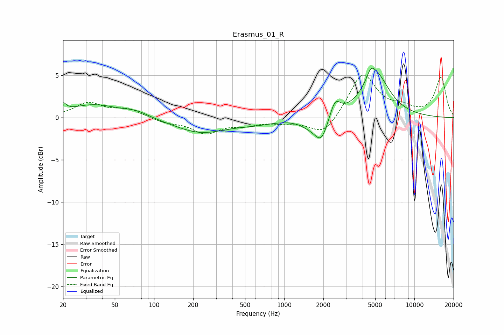

# Erasmus_01_R
See [usage instructions](https://github.com/jaakkopasanen/AutoEq#usage) for more options and info.

### Parametric EQs
Apply preamp of -6.0 dB when using parametric equalizer.

|   # | Type    |   Fc (Hz) |    Q |   Gain (dB) |
|-----|---------|-----------|------|-------------|
|   1 | Peaking |        20 | 5.98 |         0.9 |
|   2 | Peaking |        35 | 0.76 |         1.5 |
|   3 | Peaking |        73 | 1.49 |         0.6 |
|   4 | Peaking |       227 | 0.71 |        -1.7 |
|   5 | Peaking |       594 | 0.93 |        -0.5 |
|   6 | Peaking |      1556 | 1.92 |        -0.7 |
|   7 | Peaking |      1928 | 2.66 |        -2.8 |
|   8 | Peaking |      2456 | 3.5  |         2.1 |
|   9 | Peaking |      4627 | 4.99 |         1   |
|  10 | Peaking |      5029 | 1.36 |         5.1 |

### Fixed Band EQs
When using fixed band (also called graphic) equalizer, apply preamp of **-5.2 dB** (if available) and set gains manually with these parameters.

|   # | Type    |   Fc (Hz) |    Q |   Gain (dB) |
|-----|---------|-----------|------|-------------|
|   1 | Peaking |        31 | 1.41 |         1.7 |
|   2 | Peaking |        62 | 1.41 |         0.9 |
|   3 | Peaking |       125 | 1.41 |        -0.5 |
|   4 | Peaking |       250 | 1.41 |        -1.7 |
|   5 | Peaking |       500 | 1.41 |        -0.7 |
|   6 | Peaking |      1000 | 1.41 |        -0.4 |
|   7 | Peaking |      2000 | 1.41 |        -2.2 |
|   8 | Peaking |      4000 | 1.41 |         5.3 |
|   9 | Peaking |      8000 | 1.41 |         0.9 |
|  10 | Peaking |     16000 | 1.41 |         4.7 |

### Graphs

