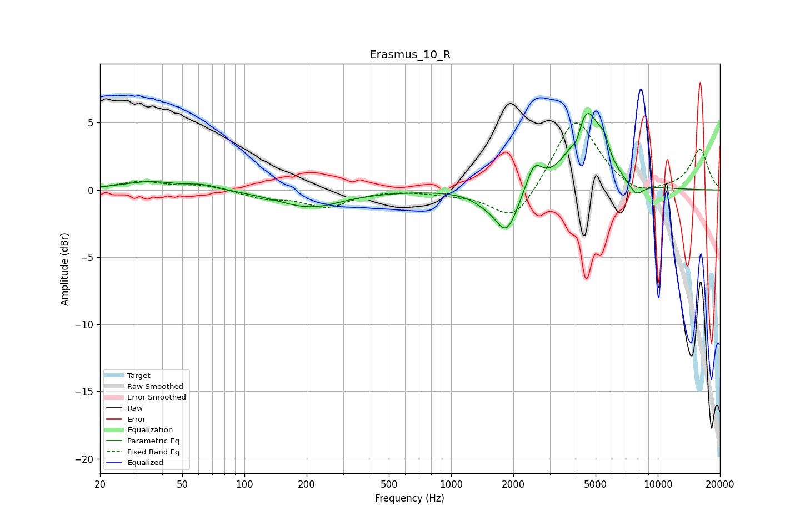

# Erasmus_10_R
See [usage instructions](https://github.com/jaakkopasanen/AutoEq#usage) for more options and info.

### Parametric EQs
Apply preamp of -5.8 dB when using parametric equalizer.

|   # | Type    |   Fc (Hz) |    Q |   Gain (dB) |
|-----|---------|-----------|------|-------------|
|   1 | Peaking |        35 | 1.08 |         0.6 |
|   2 | Peaking |        64 | 1.9  |         0.3 |
|   3 | Peaking |       207 | 0.91 |        -1.3 |
|   4 | Peaking |      1451 | 2.12 |        -0.5 |
|   5 | Peaking |      1855 | 2.56 |        -3.2 |
|   6 | Peaking |      2519 | 3.75 |         1.9 |
|   7 | Peaking |      4054 | 6    |        -1.1 |
|   8 | Peaking |      4516 | 1.97 |         6   |
|   9 | Peaking |      5499 | 6    |         1.1 |
|  10 | Peaking |      7827 | 3.63 |        -1   |

### Fixed Band EQs
When using fixed band (also called graphic) equalizer, apply preamp of **-5.1 dB** (if available) and set gains manually with these parameters.

|   # | Type    |   Fc (Hz) |    Q |   Gain (dB) |
|-----|---------|-----------|------|-------------|
|   1 | Peaking |        31 | 1.41 |         0.6 |
|   2 | Peaking |        62 | 1.41 |         0.4 |
|   3 | Peaking |       125 | 1.41 |        -0.6 |
|   4 | Peaking |       250 | 1.41 |        -1.2 |
|   5 | Peaking |       500 | 1.41 |         0.1 |
|   6 | Peaking |      1000 | 1.41 |        -0.2 |
|   7 | Peaking |      2000 | 1.41 |        -2.6 |
|   8 | Peaking |      4000 | 1.41 |         5.5 |
|   9 | Peaking |      8000 | 1.41 |        -0.7 |
|  10 | Peaking |     16000 | 1.41 |         3   |

### Graphs

