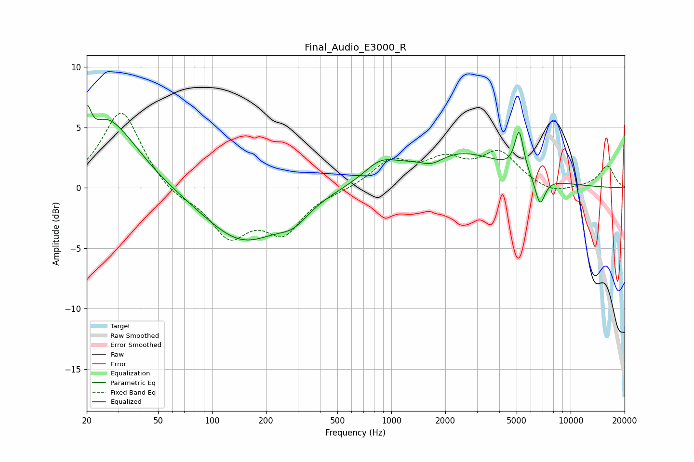

# Final_Audio_E3000_R
See [usage instructions](https://github.com/jaakkopasanen/AutoEq#usage) for more options and info.

### Parametric EQs
Apply preamp of -6.9 dB when using parametric equalizer.

|   # | Type    |   Fc (Hz) |    Q |   Gain (dB) |
|-----|---------|-----------|------|-------------|
|   1 | Peaking |        20 | 6    |         3   |
|   2 | Peaking |        25 | 1.89 |         1.3 |
|   3 | Peaking |        28 | 0.85 |         4.5 |
|   4 | Peaking |       149 | 0.65 |        -4.4 |
|   5 | Peaking |       284 | 1.73 |        -1.2 |
|   6 | Peaking |       866 | 1.57 |         1.3 |
|   7 | Peaking |      1687 | 2.05 |        -0.9 |
|   8 | Peaking |      2245 | 0.51 |         3   |
|   9 | Peaking |      5162 | 5.75 |         3.4 |
|  10 | Peaking |      6749 | 4.78 |        -2.4 |

### Fixed Band EQs
When using fixed band (also called graphic) equalizer, apply preamp of **-6.3 dB** (if available) and set gains manually with these parameters.

|   # | Type    |   Fc (Hz) |    Q |   Gain (dB) |
|-----|---------|-----------|------|-------------|
|   1 | Peaking |        31 | 1.41 |         6.5 |
|   2 | Peaking |        62 | 1.41 |        -0.8 |
|   3 | Peaking |       125 | 1.41 |        -3.8 |
|   4 | Peaking |       250 | 1.41 |        -3.4 |
|   5 | Peaking |       500 | 1.41 |        -0.2 |
|   6 | Peaking |      1000 | 1.41 |         2.2 |
|   7 | Peaking |      2000 | 1.41 |         2   |
|   8 | Peaking |      4000 | 1.41 |         2.7 |
|   9 | Peaking |      8000 | 1.41 |        -0.6 |
|  10 | Peaking |     16000 | 1.41 |         1.8 |

### Graphs

