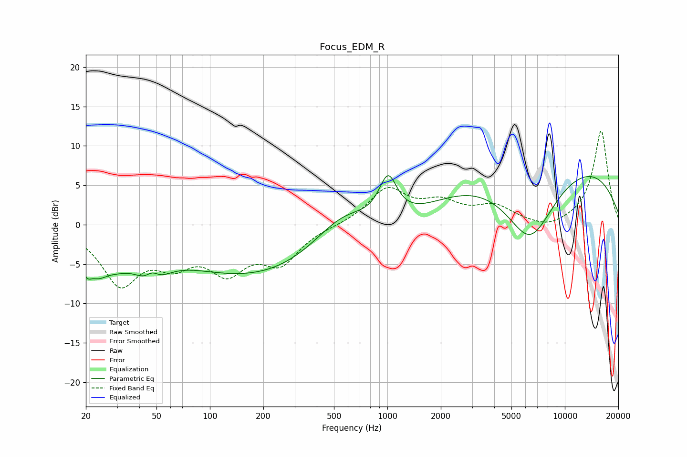

# Focus_EDM_R
See [usage instructions](https://github.com/jaakkopasanen/AutoEq#usage) for more options and info.

### Parametric EQs
Apply preamp of -6.3 dB when using parametric equalizer.

|   # | Type    |   Fc (Hz) |    Q |   Gain (dB) |
|-----|---------|-----------|------|-------------|
|   1 | Peaking |        20 | 4.75 |        -2.8 |
|   2 | Peaking |        23 | 2.58 |        -2.7 |
|   3 | Peaking |        29 | 1.5  |        -2.5 |
|   4 | Peaking |        47 | 2.01 |        -5.7 |
|   5 | Peaking |        47 | 3.16 |         3.6 |
|   6 | Peaking |       329 | 0.18 |        -7.9 |
|   7 | Peaking |       564 | 0.73 |         6.5 |
|   8 | Peaking |      1009 | 2.74 |         5.5 |
|   9 | Peaking |      6361 | 0.86 |       -10.9 |
|  10 | Peaking |      6758 | 0.19 |        10.2 |

### Fixed Band EQs
When using fixed band (also called graphic) equalizer, apply preamp of **-12.0 dB** (if available) and set gains manually with these parameters.

|   # | Type    |   Fc (Hz) |    Q |   Gain (dB) |
|-----|---------|-----------|------|-------------|
|   1 | Peaking |        31 | 1.41 |        -7.1 |
|   2 | Peaking |        62 | 1.41 |        -3.8 |
|   3 | Peaking |       125 | 1.41 |        -5.1 |
|   4 | Peaking |       250 | 1.41 |        -4.4 |
|   5 | Peaking |       500 | 1.41 |        -0.1 |
|   6 | Peaking |      1000 | 1.41 |         4.4 |
|   7 | Peaking |      2000 | 1.41 |         2.4 |
|   8 | Peaking |      4000 | 1.41 |         2.1 |
|   9 | Peaking |      8000 | 1.41 |        -0.8 |
|  10 | Peaking |     16000 | 1.41 |        12   |

### Graphs

