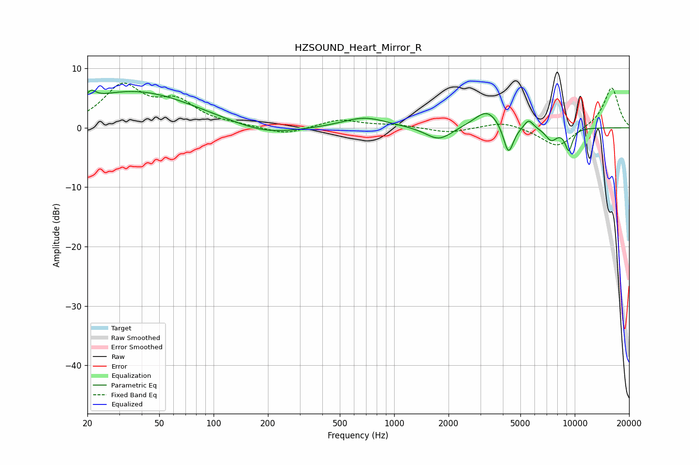

# HZSOUND_Heart_Mirror_R
See [usage instructions](https://github.com/jaakkopasanen/AutoEq#usage) for more options and info.

### Parametric EQs
Apply preamp of -6.4 dB when using parametric equalizer.

|   # | Type    |   Fc (Hz) |    Q |   Gain (dB) |
|-----|---------|-----------|------|-------------|
|   1 | Peaking |        21 | 5.77 |         1.4 |
|   2 | Peaking |        36 | 0.42 |         6.2 |
|   3 | Peaking |       194 | 0.78 |        -1.6 |
|   4 | Peaking |       685 | 1.14 |         1.8 |
|   5 | Peaking |      1767 | 1.95 |        -2.3 |
|   6 | Peaking |      3282 | 1.97 |         3.2 |
|   7 | Peaking |      4295 | 4.95 |        -5.2 |
|   8 | Peaking |      5558 | 5.59 |         1.5 |
|   9 | Peaking |      7412 | 4.12 |        -2   |
|  10 | Peaking |      9266 | 6    |        -3.6 |

### Fixed Band EQs
When using fixed band (also called graphic) equalizer, apply preamp of **-7.6 dB** (if available) and set gains manually with these parameters.

|   # | Type    |   Fc (Hz) |    Q |   Gain (dB) |
|-----|---------|-----------|------|-------------|
|   1 | Peaking |        31 | 1.41 |         6.8 |
|   2 | Peaking |        62 | 1.41 |         3.9 |
|   3 | Peaking |       125 | 1.41 |         0.3 |
|   4 | Peaking |       250 | 1.41 |        -1.2 |
|   5 | Peaking |       500 | 1.41 |         1.4 |
|   6 | Peaking |      1000 | 1.41 |         0.5 |
|   7 | Peaking |      2000 | 1.41 |        -0.9 |
|   8 | Peaking |      4000 | 1.41 |         1.1 |
|   9 | Peaking |      8000 | 1.41 |        -3.4 |
|  10 | Peaking |     16000 | 1.41 |         6.9 |

### Graphs

