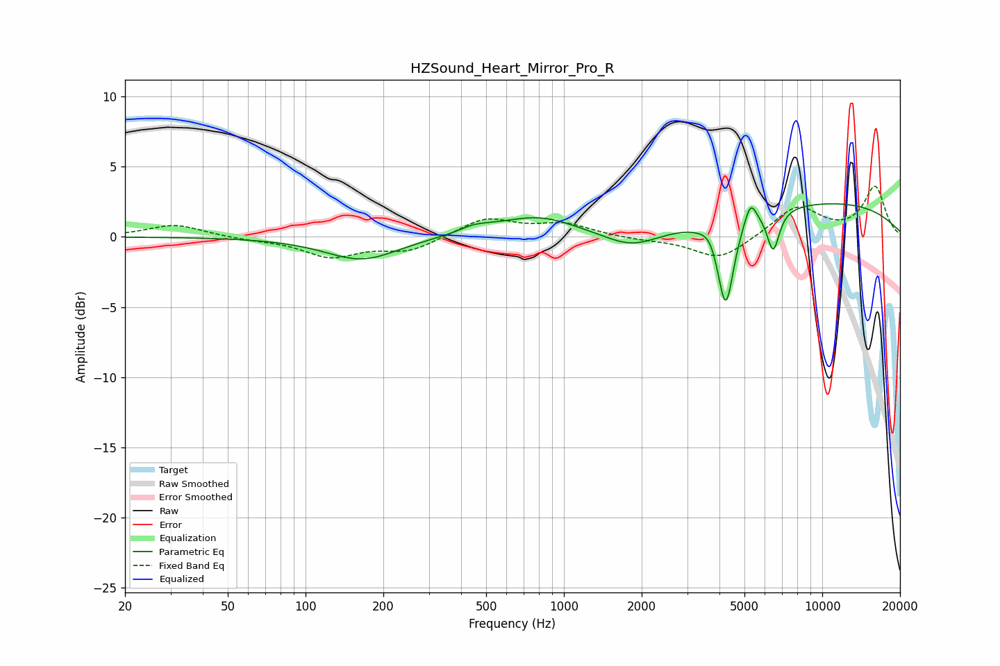

# HZSound_Heart_Mirror_Pro_R
See [usage instructions](https://github.com/jaakkopasanen/AutoEq#usage) for more options and info.

### Parametric EQs
Apply preamp of -2.5 dB when using parametric equalizer.

|   # | Type    |   Fc (Hz) |    Q |   Gain (dB) |
|-----|---------|-----------|------|-------------|
|   1 | Peaking |       165 | 1    |        -1.7 |
|   2 | Peaking |       396 | 1.86 |        -1.1 |
|   3 | Peaking |       415 | 1.68 |         1.6 |
|   4 | Peaking |       798 | 0.96 |         1.4 |
|   5 | Peaking |      1833 | 1.29 |        -1.2 |
|   6 | Peaking |      3670 | 5.34 |         0.4 |
|   7 | Peaking |      4231 | 4.56 |        -6.3 |
|   8 | Peaking |      5277 | 6    |         1.6 |
|   9 | Peaking |      6460 | 5.77 |        -2.9 |
|  10 | Peaking |     10000 | 0.29 |         2.5 |

### Fixed Band EQs
When using fixed band (also called graphic) equalizer, apply preamp of **-3.7 dB** (if available) and set gains manually with these parameters.

|   # | Type    |   Fc (Hz) |    Q |   Gain (dB) |
|-----|---------|-----------|------|-------------|
|   1 | Peaking |        31 | 1.41 |         0.9 |
|   2 | Peaking |        62 | 1.41 |        -0.2 |
|   3 | Peaking |       125 | 1.41 |        -1.4 |
|   4 | Peaking |       250 | 1.41 |        -1   |
|   5 | Peaking |       500 | 1.41 |         1.3 |
|   6 | Peaking |      1000 | 1.41 |         0.9 |
|   7 | Peaking |      2000 | 1.41 |        -0.2 |
|   8 | Peaking |      4000 | 1.41 |        -1.7 |
|   9 | Peaking |      8000 | 1.41 |         2.2 |
|  10 | Peaking |     16000 | 1.41 |         3.5 |

### Graphs

