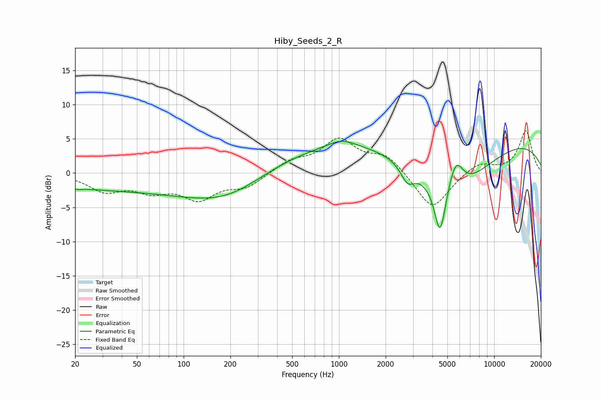

# Hiby_Seeds_2_R
See [usage instructions](https://github.com/jaakkopasanen/AutoEq#usage) for more options and info.

### Parametric EQs
Apply preamp of -4.7 dB when using parametric equalizer.

|   # | Type    |   Fc (Hz) |    Q |   Gain (dB) |
|-----|---------|-----------|------|-------------|
|   1 | Peaking |        21 | 5.48 |        -0.2 |
|   2 | Peaking |        53 | 0.18 |        -2.5 |
|   3 | Peaking |       198 | 0.56 |        -3.6 |
|   4 | Peaking |      1020 | 0.19 |         4.4 |
|   5 | Peaking |      1040 | 1.56 |         1.2 |
|   6 | Peaking |      2769 | 3.17 |        -2.5 |
|   7 | Peaking |      4483 | 4    |        -7.3 |
|   8 | Peaking |      5267 | 0.61 |        -9.6 |
|   9 | Peaking |      5653 | 2.74 |         5.1 |
|  10 | Peaking |      9856 | 0.23 |         5.5 |

### Fixed Band EQs
When using fixed band (also called graphic) equalizer, apply preamp of **-6.3 dB** (if available) and set gains manually with these parameters.

|   # | Type    |   Fc (Hz) |    Q |   Gain (dB) |
|-----|---------|-----------|------|-------------|
|   1 | Peaking |        31 | 1.41 |        -2.4 |
|   2 | Peaking |        62 | 1.41 |        -2.2 |
|   3 | Peaking |       125 | 1.41 |        -3.4 |
|   4 | Peaking |       250 | 1.41 |        -1.9 |
|   5 | Peaking |       500 | 1.41 |         1.6 |
|   6 | Peaking |      1000 | 1.41 |         4.6 |
|   7 | Peaking |      2000 | 1.41 |         2.5 |
|   8 | Peaking |      4000 | 1.41 |        -5.5 |
|   9 | Peaking |      8000 | 1.41 |         1.6 |
|  10 | Peaking |     16000 | 1.41 |         6.2 |

### Graphs

