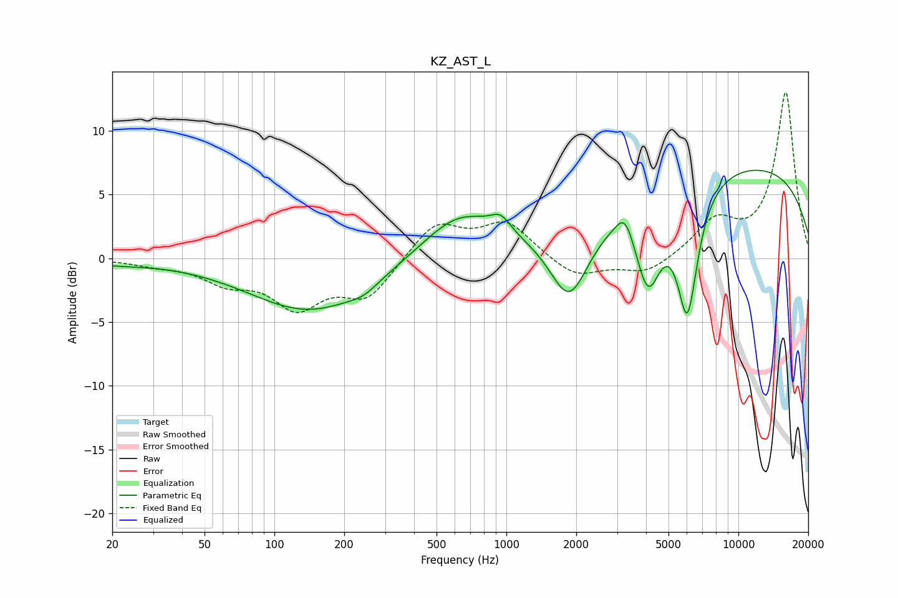

# KZ_AST_L
See [usage instructions](https://github.com/jaakkopasanen/AutoEq#usage) for more options and info.

### Parametric EQs
Apply preamp of -7.0 dB when using parametric equalizer.

|   # | Type    |   Fc (Hz) |    Q |   Gain (dB) |
|-----|---------|-----------|------|-------------|
|   1 | Peaking |        20 | 0.93 |        -0.3 |
|   2 | Peaking |       144 | 0.53 |        -4.2 |
|   3 | Peaking |       242 | 2.29 |        -0.6 |
|   4 | Peaking |       628 | 0.86 |         3.5 |
|   5 | Peaking |       946 | 3.32 |         1.2 |
|   6 | Peaking |      1870 | 1.62 |        -6   |
|   7 | Peaking |      3247 | 3.66 |         1.9 |
|   8 | Peaking |      4080 | 2.41 |        -6.8 |
|   9 | Peaking |      6030 | 2.95 |       -10   |
|  10 | Peaking |      9255 | 0.2  |         7.5 |

### Fixed Band EQs
When using fixed band (also called graphic) equalizer, apply preamp of **-13.1 dB** (if available) and set gains manually with these parameters.

|   # | Type    |   Fc (Hz) |    Q |   Gain (dB) |
|-----|---------|-----------|------|-------------|
|   1 | Peaking |        31 | 1.41 |        -0.4 |
|   2 | Peaking |        62 | 1.41 |        -1.6 |
|   3 | Peaking |       125 | 1.41 |        -3.5 |
|   4 | Peaking |       250 | 1.41 |        -3   |
|   5 | Peaking |       500 | 1.41 |         2.8 |
|   6 | Peaking |      1000 | 1.41 |         2.7 |
|   7 | Peaking |      2000 | 1.41 |        -1.6 |
|   8 | Peaking |      4000 | 1.41 |        -1.3 |
|   9 | Peaking |      8000 | 1.41 |         2.7 |
|  10 | Peaking |     16000 | 1.41 |        13   |

### Graphs

