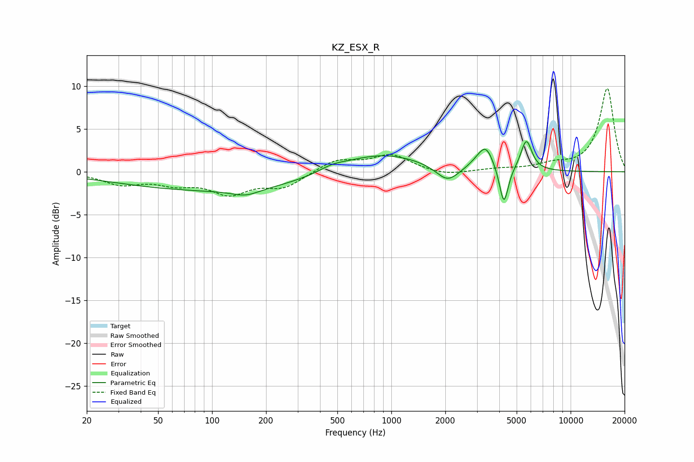

# KZ_ESX_R
See [usage instructions](https://github.com/jaakkopasanen/AutoEq#usage) for more options and info.

### Parametric EQs
Apply preamp of -3.6 dB when using parametric equalizer.

|   # | Type    |   Fc (Hz) |    Q |   Gain (dB) |
|-----|---------|-----------|------|-------------|
|   1 | Peaking |       113 | 0.24 |        -2.2 |
|   2 | Peaking |       154 | 1.82 |        -0.8 |
|   3 | Peaking |       467 | 1.88 |         0.5 |
|   4 | Peaking |       846 | 0.58 |         2.4 |
|   5 | Peaking |      2030 | 1.77 |        -0.4 |
|   6 | Peaking |      2061 | 2.33 |        -1.5 |
|   7 | Peaking |      3053 | 2.65 |         0.7 |
|   8 | Peaking |      3376 | 3.43 |         2.4 |
|   9 | Peaking |      4243 | 5.8  |        -4.5 |
|  10 | Peaking |      5662 | 4.5  |         3.6 |

### Fixed Band EQs
When using fixed band (also called graphic) equalizer, apply preamp of **-9.8 dB** (if available) and set gains manually with these parameters.

|   # | Type    |   Fc (Hz) |    Q |   Gain (dB) |
|-----|---------|-----------|------|-------------|
|   1 | Peaking |        31 | 1.41 |        -1.3 |
|   2 | Peaking |        62 | 1.41 |        -1.2 |
|   3 | Peaking |       125 | 1.41 |        -2.3 |
|   4 | Peaking |       250 | 1.41 |        -1.7 |
|   5 | Peaking |       500 | 1.41 |         1.4 |
|   6 | Peaking |      1000 | 1.41 |         1.9 |
|   7 | Peaking |      2000 | 1.41 |        -0.5 |
|   8 | Peaking |      4000 | 1.41 |         0.3 |
|   9 | Peaking |      8000 | 1.41 |         0.7 |
|  10 | Peaking |     16000 | 1.41 |         9.7 |

### Graphs

