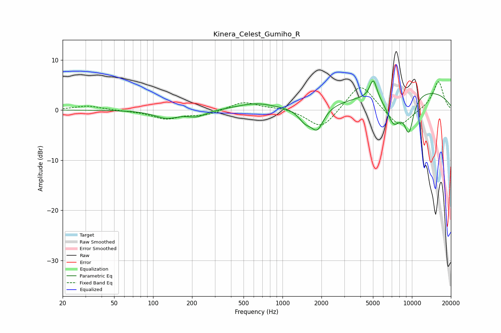

# Kinera_Celest_Gumiho_R
See [usage instructions](https://github.com/jaakkopasanen/AutoEq#usage) for more options and info.

### Parametric EQs
Apply preamp of -5.9 dB when using parametric equalizer.

|   # | Type    |   Fc (Hz) |    Q |   Gain (dB) |
|-----|---------|-----------|------|-------------|
|   1 | Peaking |       127 | 1.54 |        -1.6 |
|   2 | Peaking |       218 | 2.05 |        -1.1 |
|   3 | Peaking |       621 | 0.97 |         1.3 |
|   4 | Peaking |      1489 | 2.78 |        -2.2 |
|   5 | Peaking |      1857 | 2.87 |        -4.3 |
|   6 | Peaking |      4929 | 5.25 |         0.6 |
|   7 | Peaking |      5048 | 4.93 |         3.4 |
|   8 | Peaking |      7239 | 2.3  |        -5.7 |
|   9 | Peaking |      9472 | 3.2  |        -7   |
|  10 | Peaking |     10000 | 0.26 |         4.2 |

### Fixed Band EQs
When using fixed band (also called graphic) equalizer, apply preamp of **-5.7 dB** (if available) and set gains manually with these parameters.

|   # | Type    |   Fc (Hz) |    Q |   Gain (dB) |
|-----|---------|-----------|------|-------------|
|   1 | Peaking |        31 | 1.41 |         0.8 |
|   2 | Peaking |        62 | 1.41 |        -0.1 |
|   3 | Peaking |       125 | 1.41 |        -1.7 |
|   4 | Peaking |       250 | 1.41 |        -1   |
|   5 | Peaking |       500 | 1.41 |         1.7 |
|   6 | Peaking |      1000 | 1.41 |         0.5 |
|   7 | Peaking |      2000 | 1.41 |        -3.9 |
|   8 | Peaking |      4000 | 1.41 |         5.6 |
|   9 | Peaking |      8000 | 1.41 |        -3.7 |
|  10 | Peaking |     16000 | 1.41 |         5.8 |

### Graphs

