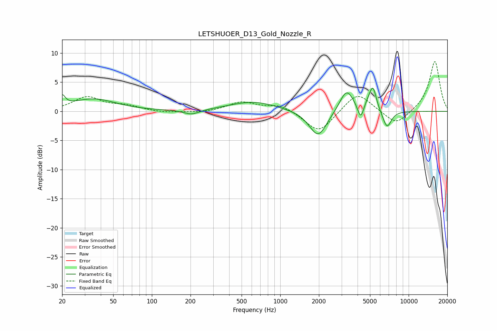

# LETSHUOER_D13_Gold_Nozzle_R
See [usage instructions](https://github.com/jaakkopasanen/AutoEq#usage) for more options and info.

### Parametric EQs
Apply preamp of -4.1 dB when using parametric equalizer.

|   # | Type    |   Fc (Hz) |    Q |   Gain (dB) |
|-----|---------|-----------|------|-------------|
|   1 | Peaking |        20 | 6    |         1.8 |
|   2 | Peaking |        35 | 0.82 |         2.1 |
|   3 | Peaking |       204 | 2.32 |        -0.8 |
|   4 | Peaking |       614 | 0.76 |         1.7 |
|   5 | Peaking |      1971 | 2.04 |        -4.6 |
|   6 | Peaking |      3285 | 2.59 |         3.9 |
|   7 | Peaking |      4233 | 6    |        -2.5 |
|   8 | Peaking |      4918 | 3.82 |         1.4 |
|   9 | Peaking |      5290 | 5.37 |         3.4 |
|  10 | Peaking |      6783 | 4.04 |        -3   |

### Fixed Band EQs
When using fixed band (also called graphic) equalizer, apply preamp of **-8.6 dB** (if available) and set gains manually with these parameters.

|   # | Type    |   Fc (Hz) |    Q |   Gain (dB) |
|-----|---------|-----------|------|-------------|
|   1 | Peaking |        31 | 1.41 |         2.4 |
|   2 | Peaking |        62 | 1.41 |         0.8 |
|   3 | Peaking |       125 | 1.41 |        -0.3 |
|   4 | Peaking |       250 | 1.41 |        -0.3 |
|   5 | Peaking |       500 | 1.41 |         1.6 |
|   6 | Peaking |      1000 | 1.41 |         1.1 |
|   7 | Peaking |      2000 | 1.41 |        -3.8 |
|   8 | Peaking |      4000 | 1.41 |         3.4 |
|   9 | Peaking |      8000 | 1.41 |        -2.5 |
|  10 | Peaking |     16000 | 1.41 |         8.7 |

### Graphs

