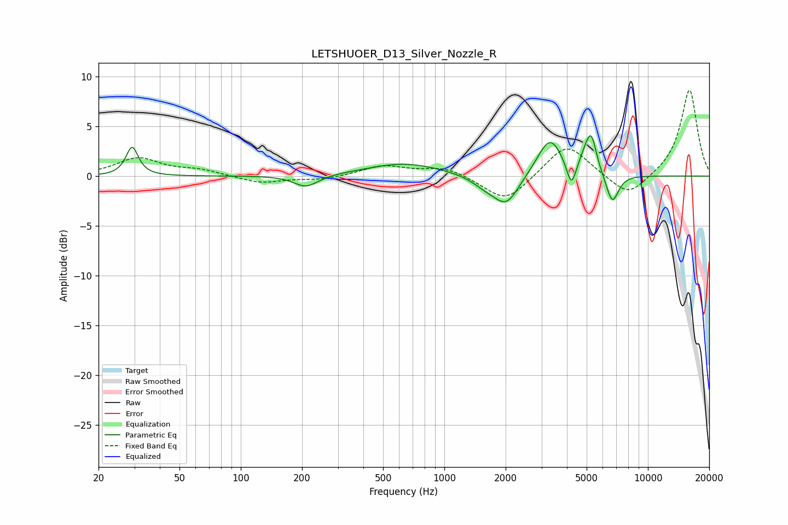

# LETSHUOER_D13_Silver_Nozzle_R
See [usage instructions](https://github.com/jaakkopasanen/AutoEq#usage) for more options and info.

### Parametric EQs
Apply preamp of -4.2 dB when using parametric equalizer.

|   # | Type    |   Fc (Hz) |    Q |   Gain (dB) |
|-----|---------|-----------|------|-------------|
|   1 | Peaking |        29 | 4.9  |         2.9 |
|   2 | Peaking |       209 | 2.37 |        -1.2 |
|   3 | Peaking |       639 | 0.76 |         1.3 |
|   4 | Peaking |      1602 | 2.04 |        -0.9 |
|   5 | Peaking |      2023 | 2.29 |        -2.8 |
|   6 | Peaking |      3301 | 2.28 |         3.9 |
|   7 | Peaking |      4208 | 6    |        -2.6 |
|   8 | Peaking |      4934 | 3.95 |         1.4 |
|   9 | Peaking |      5274 | 5.37 |         3.2 |
|  10 | Peaking |      6684 | 4.43 |        -3   |

### Fixed Band EQs
When using fixed band (also called graphic) equalizer, apply preamp of **-8.7 dB** (if available) and set gains manually with these parameters.

|   # | Type    |   Fc (Hz) |    Q |   Gain (dB) |
|-----|---------|-----------|------|-------------|
|   1 | Peaking |        31 | 1.41 |         1.8 |
|   2 | Peaking |        62 | 1.41 |         0.6 |
|   3 | Peaking |       125 | 1.41 |        -0.7 |
|   4 | Peaking |       250 | 1.41 |        -0.4 |
|   5 | Peaking |       500 | 1.41 |         1   |
|   6 | Peaking |      1000 | 1.41 |         0.9 |
|   7 | Peaking |      2000 | 1.41 |        -2.7 |
|   8 | Peaking |      4000 | 1.41 |         3.4 |
|   9 | Peaking |      8000 | 1.41 |        -2.3 |
|  10 | Peaking |     16000 | 1.41 |         8.8 |

### Graphs

