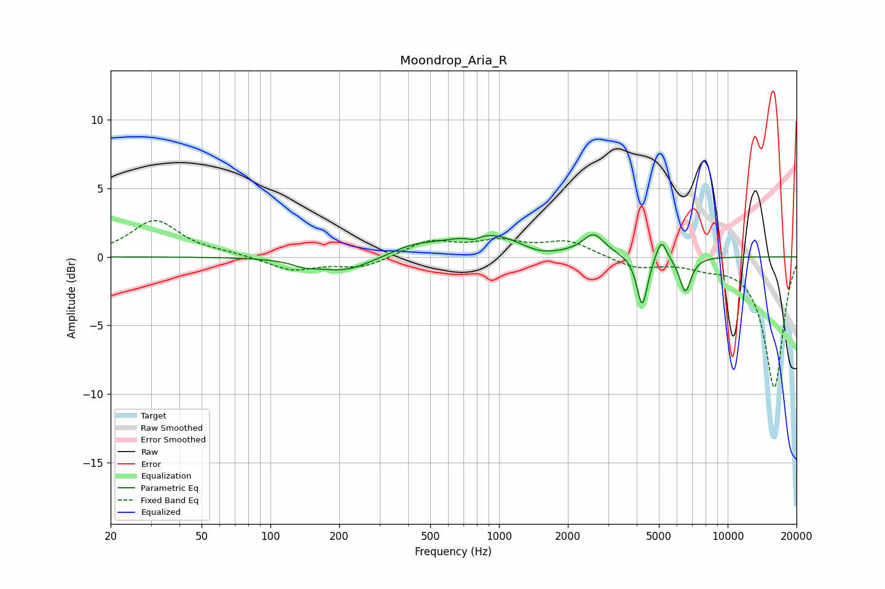

# Moondrop_Aria_R
See [usage instructions](https://github.com/jaakkopasanen/AutoEq#usage) for more options and info.

### Parametric EQs
Apply preamp of -1.7 dB when using parametric equalizer.

|   # | Type    |   Fc (Hz) |    Q |   Gain (dB) |
|-----|---------|-----------|------|-------------|
|   1 | Peaking |       141 | 2.61 |        -0.3 |
|   2 | Peaking |       211 | 1.16 |        -1.1 |
|   3 | Peaking |       419 | 1.39 |         0.6 |
|   4 | Peaking |       772 | 4.93 |        -0.3 |
|   5 | Peaking |       905 | 0.82 |         1.7 |
|   6 | Peaking |      1491 | 1.61 |        -0.6 |
|   7 | Peaking |      2594 | 2.95 |         1.5 |
|   8 | Peaking |      4228 | 5.99 |        -3.7 |
|   9 | Peaking |      5123 | 6    |         1.6 |
|  10 | Peaking |      6528 | 5.39 |        -2.6 |

### Fixed Band EQs
When using fixed band (also called graphic) equalizer, apply preamp of **-2.7 dB** (if available) and set gains manually with these parameters.

|   # | Type    |   Fc (Hz) |    Q |   Gain (dB) |
|-----|---------|-----------|------|-------------|
|   1 | Peaking |        31 | 1.41 |         2.6 |
|   2 | Peaking |        62 | 1.41 |         0.2 |
|   3 | Peaking |       125 | 1.41 |        -1   |
|   4 | Peaking |       250 | 1.41 |        -0.8 |
|   5 | Peaking |       500 | 1.41 |         1.1 |
|   6 | Peaking |      1000 | 1.41 |         1   |
|   7 | Peaking |      2000 | 1.41 |         1.1 |
|   8 | Peaking |      4000 | 1.41 |        -0.8 |
|   9 | Peaking |      8000 | 1.41 |        -0.5 |
|  10 | Peaking |     16000 | 1.41 |        -9.5 |

### Graphs

