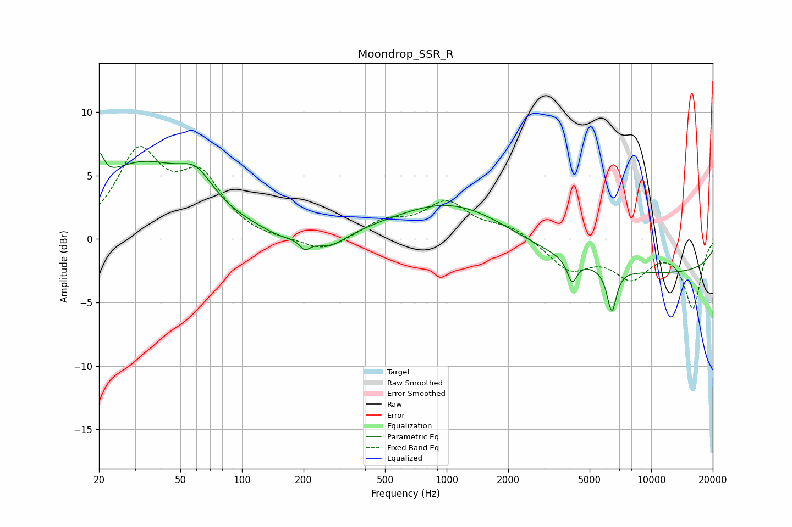

# Moondrop_SSR_R
See [usage instructions](https://github.com/jaakkopasanen/AutoEq#usage) for more options and info.

### Parametric EQs
Apply preamp of -6.8 dB when using parametric equalizer.

|   # | Type    |   Fc (Hz) |    Q |   Gain (dB) |
|-----|---------|-----------|------|-------------|
|   1 | Peaking |        20 | 5.98 |         2.3 |
|   2 | Peaking |        32 | 0.56 |         5.7 |
|   3 | Peaking |        60 | 1.77 |         2.1 |
|   4 | Peaking |       155 | 1.51 |        -0.5 |
|   5 | Peaking |       203 | 5.79 |        -0.8 |
|   6 | Peaking |       267 | 1.61 |        -1.2 |
|   7 | Peaking |      1084 | 0.51 |         3.2 |
|   8 | Peaking |      4106 | 6    |        -1.8 |
|   9 | Peaking |      6420 | 5.97 |        -3.4 |
|  10 | Peaking |     10000 | 0.18 |        -2.7 |

### Fixed Band EQs
When using fixed band (also called graphic) equalizer, apply preamp of **-7.4 dB** (if available) and set gains manually with these parameters.

|   # | Type    |   Fc (Hz) |    Q |   Gain (dB) |
|-----|---------|-----------|------|-------------|
|   1 | Peaking |        31 | 1.41 |         6.5 |
|   2 | Peaking |        62 | 1.41 |         4.4 |
|   3 | Peaking |       125 | 1.41 |        -0.2 |
|   4 | Peaking |       250 | 1.41 |        -1.1 |
|   5 | Peaking |       500 | 1.41 |         1.3 |
|   6 | Peaking |      1000 | 1.41 |         2.7 |
|   7 | Peaking |      2000 | 1.41 |         0.9 |
|   8 | Peaking |      4000 | 1.41 |        -2.3 |
|   9 | Peaking |      8000 | 1.41 |        -2.7 |
|  10 | Peaking |     16000 | 1.41 |        -5.3 |

### Graphs

