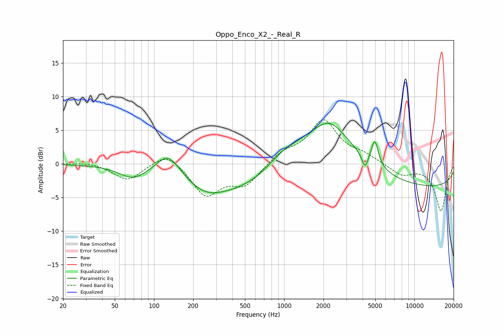

# Oppo_Enco_X2_-_Real_R
See [usage instructions](https://github.com/jaakkopasanen/AutoEq#usage) for more options and info.

### Parametric EQs
Apply preamp of -6.1 dB when using parametric equalizer.

|   # | Type    |   Fc (Hz) |    Q |   Gain (dB) |
|-----|---------|-----------|------|-------------|
|   1 | Peaking |        69 | 1.34 |        -1.9 |
|   2 | Peaking |       129 | 1.58 |         3.3 |
|   3 | Peaking |       244 | 1.02 |        -1.7 |
|   4 | Peaking |       515 | 0.36 |        -4.4 |
|   5 | Peaking |       970 | 1.04 |         2.2 |
|   6 | Peaking |      2110 | 0.55 |         6.9 |
|   7 | Peaking |      2246 | 1.38 |         1.9 |
|   8 | Peaking |      4177 | 6    |        -2.1 |
|   9 | Peaking |      4962 | 5.07 |         3.8 |
|  10 | Peaking |     10000 | 0.18 |        -3.6 |

### Fixed Band EQs
When using fixed band (also called graphic) equalizer, apply preamp of **-6.7 dB** (if available) and set gains manually with these parameters.

|   # | Type    |   Fc (Hz) |    Q |   Gain (dB) |
|-----|---------|-----------|------|-------------|
|   1 | Peaking |        31 | 1.41 |         0.3 |
|   2 | Peaking |        62 | 1.41 |        -2.5 |
|   3 | Peaking |       125 | 1.41 |         2   |
|   4 | Peaking |       250 | 1.41 |        -4.6 |
|   5 | Peaking |       500 | 1.41 |        -3   |
|   6 | Peaking |      1000 | 1.41 |         1.6 |
|   7 | Peaking |      2000 | 1.41 |         6.3 |
|   8 | Peaking |      4000 | 1.41 |         1.1 |
|   9 | Peaking |      8000 | 1.41 |        -1.6 |
|  10 | Peaking |     16000 | 1.41 |        -7   |

### Graphs

