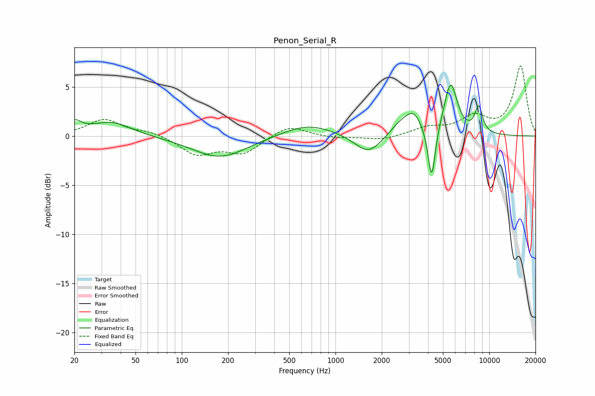

# Penon_Serial_R
See [usage instructions](https://github.com/jaakkopasanen/AutoEq#usage) for more options and info.

### Parametric EQs
Apply preamp of -5.3 dB when using parametric equalizer.

|   # | Type    |   Fc (Hz) |    Q |   Gain (dB) |
|-----|---------|-----------|------|-------------|
|   1 | Peaking |        20 | 3.13 |         1.2 |
|   2 | Peaking |        35 | 1.09 |         1.4 |
|   3 | Peaking |       177 | 0.79 |        -2.2 |
|   4 | Peaking |       662 | 0.85 |         1.3 |
|   5 | Peaking |      1633 | 1.62 |        -2   |
|   6 | Peaking |      2605 | 2.12 |         1   |
|   7 | Peaking |      3219 | 2.49 |         2.1 |
|   8 | Peaking |      4220 | 5.85 |        -5.6 |
|   9 | Peaking |      5609 | 3.2  |         5.3 |
|  10 | Peaking |      8541 | 5.17 |         2.6 |

### Fixed Band EQs
When using fixed band (also called graphic) equalizer, apply preamp of **-7.2 dB** (if available) and set gains manually with these parameters.

|   # | Type    |   Fc (Hz) |    Q |   Gain (dB) |
|-----|---------|-----------|------|-------------|
|   1 | Peaking |        31 | 1.41 |         1.7 |
|   2 | Peaking |        62 | 1.41 |         0.4 |
|   3 | Peaking |       125 | 1.41 |        -1.8 |
|   4 | Peaking |       250 | 1.41 |        -1.7 |
|   5 | Peaking |       500 | 1.41 |         1.1 |
|   6 | Peaking |      1000 | 1.41 |        -0.2 |
|   7 | Peaking |      2000 | 1.41 |        -0.4 |
|   8 | Peaking |      4000 | 1.41 |         0.8 |
|   9 | Peaking |      8000 | 1.41 |         1.8 |
|  10 | Peaking |     16000 | 1.41 |         7.1 |

### Graphs

