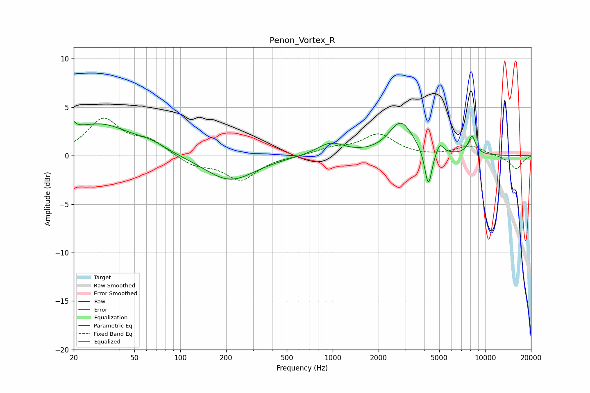

# Penon_Vortex_R
See [usage instructions](https://github.com/jaakkopasanen/AutoEq#usage) for more options and info.

### Parametric EQs
Apply preamp of -3.7 dB when using parametric equalizer.

|   # | Type    |   Fc (Hz) |    Q |   Gain (dB) |
|-----|---------|-----------|------|-------------|
|   1 | Peaking |        20 | 5.38 |         3.2 |
|   2 | Peaking |        20 | 6    |        -2.1 |
|   3 | Peaking |        29 | 0.69 |         3.2 |
|   4 | Peaking |        64 | 1.4  |         0.7 |
|   5 | Peaking |       212 | 0.86 |        -2.6 |
|   6 | Peaking |       968 | 1.57 |         1.3 |
|   7 | Peaking |      2803 | 1.8  |         3.4 |
|   8 | Peaking |      4242 | 5.98 |        -3.9 |
|   9 | Peaking |      5052 | 6    |         1.1 |
|  10 | Peaking |      8194 | 5.25 |         1.9 |

### Fixed Band EQs
When using fixed band (also called graphic) equalizer, apply preamp of **-4.0 dB** (if available) and set gains manually with these parameters.

|   # | Type    |   Fc (Hz) |    Q |   Gain (dB) |
|-----|---------|-----------|------|-------------|
|   1 | Peaking |        31 | 1.41 |         3.7 |
|   2 | Peaking |        62 | 1.41 |         1.4 |
|   3 | Peaking |       125 | 1.41 |        -1   |
|   4 | Peaking |       250 | 1.41 |        -2.5 |
|   5 | Peaking |       500 | 1.41 |        -0.1 |
|   6 | Peaking |      1000 | 1.41 |         0.7 |
|   7 | Peaking |      2000 | 1.41 |         2.1 |
|   8 | Peaking |      4000 | 1.41 |        -0.1 |
|   9 | Peaking |      8000 | 1.41 |         1   |
|  10 | Peaking |     16000 | 1.41 |        -1.4 |

### Graphs

