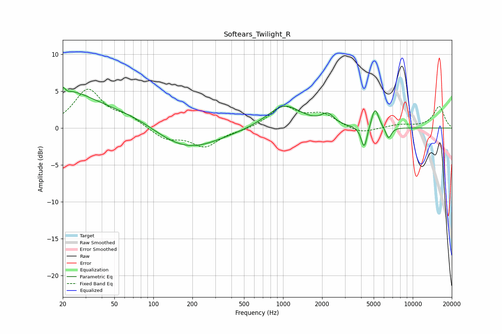

# Softears_Twilight_R
See [usage instructions](https://github.com/jaakkopasanen/AutoEq#usage) for more options and info.

### Parametric EQs
Apply preamp of -5.6 dB when using parametric equalizer.

|   # | Type    |   Fc (Hz) |    Q |   Gain (dB) |
|-----|---------|-----------|------|-------------|
|   1 | Peaking |        20 | 0.55 |         4.9 |
|   2 | Peaking |        21 | 5.96 |         3.2 |
|   3 | Peaking |        21 | 5.88 |        -3   |
|   4 | Peaking |        70 | 0.62 |         1.5 |
|   5 | Peaking |       177 | 0.56 |        -3.2 |
|   6 | Peaking |      1022 | 1.07 |         3.2 |
|   7 | Peaking |      2208 | 3.01 |         1.4 |
|   8 | Peaking |      4221 | 6    |        -3.1 |
|   9 | Peaking |      5120 | 4.98 |         2.8 |
|  10 | Peaking |      6501 | 5.99 |        -1.6 |

### Fixed Band EQs
When using fixed band (also called graphic) equalizer, apply preamp of **-5.4 dB** (if available) and set gains manually with these parameters.

|   # | Type    |   Fc (Hz) |    Q |   Gain (dB) |
|-----|---------|-----------|------|-------------|
|   1 | Peaking |        31 | 1.41 |         5.1 |
|   2 | Peaking |        62 | 1.41 |         1.3 |
|   3 | Peaking |       125 | 1.41 |        -1.5 |
|   4 | Peaking |       250 | 1.41 |        -2.4 |
|   5 | Peaking |       500 | 1.41 |        -0.3 |
|   6 | Peaking |      1000 | 1.41 |         2.8 |
|   7 | Peaking |      2000 | 1.41 |         1.8 |
|   8 | Peaking |      4000 | 1.41 |        -0.8 |
|   9 | Peaking |      8000 | 1.41 |         0.4 |
|  10 | Peaking |     16000 | 1.41 |         2.9 |

### Graphs

