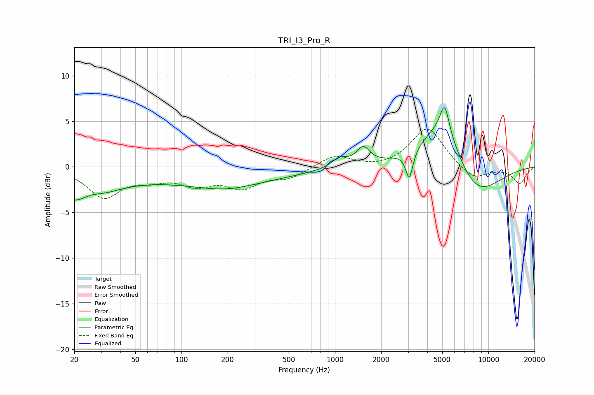

# TRI_I3_Pro_R
See [usage instructions](https://github.com/jaakkopasanen/AutoEq#usage) for more options and info.

### Parametric EQs
Apply preamp of -6.6 dB when using parametric equalizer.

|   # | Type    |   Fc (Hz) |    Q |   Gain (dB) |
|-----|---------|-----------|------|-------------|
|   1 | Peaking |        21 | 0.66 |        -3.7 |
|   2 | Peaking |        26 | 2.31 |         0.6 |
|   3 | Peaking |       180 | 0.33 |        -1.8 |
|   4 | Peaking |       193 | 0.89 |        -0.6 |
|   5 | Peaking |      1072 | 2.86 |         1   |
|   6 | Peaking |      1527 | 3.27 |         1.9 |
|   7 | Peaking |      3052 | 6    |        -3.1 |
|   8 | Peaking |      5097 | 0.96 |         6.1 |
|   9 | Peaking |      5186 | 4.81 |         3.1 |
|  10 | Peaking |      7932 | 0.8  |        -4.6 |

### Fixed Band EQs
When using fixed band (also called graphic) equalizer, apply preamp of **-4.2 dB** (if available) and set gains manually with these parameters.

|   # | Type    |   Fc (Hz) |    Q |   Gain (dB) |
|-----|---------|-----------|------|-------------|
|   1 | Peaking |        31 | 1.41 |        -3.2 |
|   2 | Peaking |        62 | 1.41 |        -1   |
|   3 | Peaking |       125 | 1.41 |        -1.7 |
|   4 | Peaking |       250 | 1.41 |        -2   |
|   5 | Peaking |       500 | 1.41 |        -1.1 |
|   6 | Peaking |      1000 | 1.41 |         1.3 |
|   7 | Peaking |      2000 | 1.41 |        -0.2 |
|   8 | Peaking |      4000 | 1.41 |         4.4 |
|   9 | Peaking |      8000 | 1.41 |        -1.5 |
|  10 | Peaking |     16000 | 1.41 |        -1.8 |

### Graphs

