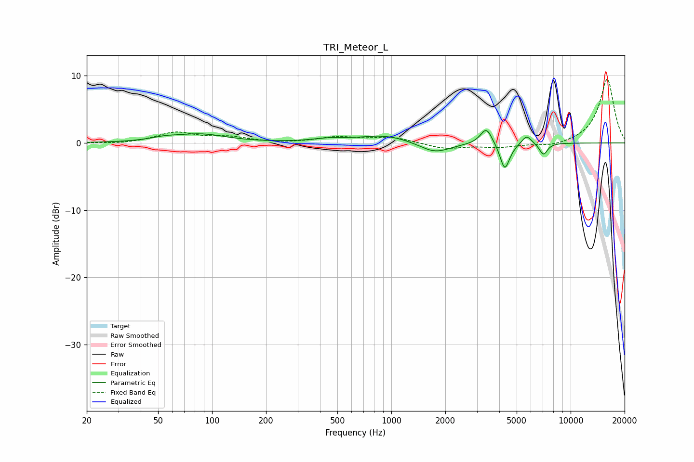

# TRI_Meteor_L
See [usage instructions](https://github.com/jaakkopasanen/AutoEq#usage) for more options and info.

### Parametric EQs
Apply preamp of -2.0 dB when using parametric equalizer.

|   # | Type    |   Fc (Hz) |    Q |   Gain (dB) |
|-----|---------|-----------|------|-------------|
|   1 | Peaking |        54 | 1.86 |         0.4 |
|   2 | Peaking |        86 | 0.99 |         1.2 |
|   3 | Peaking |       443 | 1.61 |         0.4 |
|   4 | Peaking |       921 | 0.99 |         1.2 |
|   5 | Peaking |      1748 | 1.62 |        -1.6 |
|   6 | Peaking |      3386 | 4.36 |         2.5 |
|   7 | Peaking |      4282 | 5.71 |        -3.3 |
|   8 | Peaking |      4413 | 3.87 |        -0.8 |
|   9 | Peaking |      5680 | 5.1  |         1.4 |
|  10 | Peaking |      7052 | 6    |        -1.8 |

### Fixed Band EQs
When using fixed band (also called graphic) equalizer, apply preamp of **-9.6 dB** (if available) and set gains manually with these parameters.

|   # | Type    |   Fc (Hz) |    Q |   Gain (dB) |
|-----|---------|-----------|------|-------------|
|   1 | Peaking |        31 | 1.41 |        -0.2 |
|   2 | Peaking |        62 | 1.41 |         1.5 |
|   3 | Peaking |       125 | 1.41 |         0.8 |
|   4 | Peaking |       250 | 1.41 |        -0.1 |
|   5 | Peaking |       500 | 1.41 |         0.8 |
|   6 | Peaking |      1000 | 1.41 |         0.8 |
|   7 | Peaking |      2000 | 1.41 |        -0.9 |
|   8 | Peaking |      4000 | 1.41 |        -0.6 |
|   9 | Peaking |      8000 | 1.41 |        -0.6 |
|  10 | Peaking |     16000 | 1.41 |         9.6 |

### Graphs

