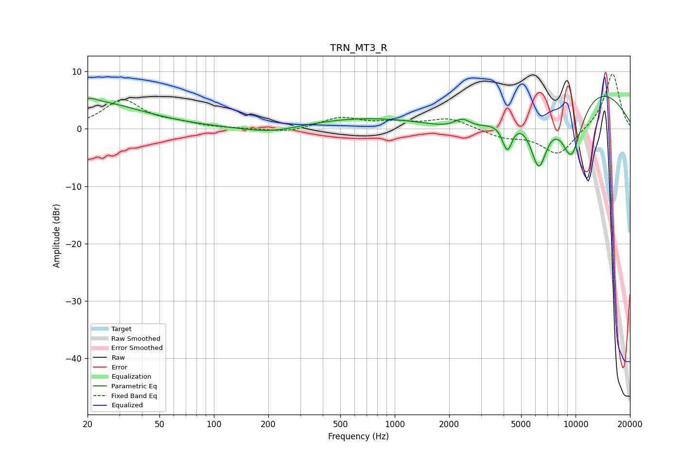

# TRN_MT3_R
See [usage instructions](https://github.com/jaakkopasanen/AutoEq#usage) for more options and info.

### Parametric EQs
Apply preamp of -5.8 dB when using parametric equalizer.

|   # | Type    |   Fc (Hz) |    Q |   Gain (dB) |
|-----|---------|-----------|------|-------------|
|   1 | Peaking |        20 | 0.49 |         4.8 |
|   2 | Peaking |        21 | 4.24 |         0.5 |
|   3 | Peaking |       210 | 0.92 |        -1.2 |
|   4 | Peaking |       684 | 0.41 |         1.9 |
|   5 | Peaking |      2365 | 2.99 |         1.8 |
|   6 | Peaking |      2688 | 0.75 |        -4.1 |
|   7 | Peaking |      4195 | 4.76 |        -5.3 |
|   8 | Peaking |      6259 | 2.53 |       -11.3 |
|   9 | Peaking |      9121 | 0.33 |        11   |
|  10 | Peaking |      9478 | 1.66 |       -13.3 |

### Fixed Band EQs
When using fixed band (also called graphic) equalizer, apply preamp of **-9.7 dB** (if available) and set gains manually with these parameters.

|   # | Type    |   Fc (Hz) |    Q |   Gain (dB) |
|-----|---------|-----------|------|-------------|
|   1 | Peaking |        31 | 1.41 |         4.9 |
|   2 | Peaking |        62 | 1.41 |         0.7 |
|   3 | Peaking |       125 | 1.41 |        -0   |
|   4 | Peaking |       250 | 1.41 |        -0.7 |
|   5 | Peaking |       500 | 1.41 |         1.9 |
|   6 | Peaking |      1000 | 1.41 |         0.9 |
|   7 | Peaking |      2000 | 1.41 |         1.8 |
|   8 | Peaking |      4000 | 1.41 |        -1.4 |
|   9 | Peaking |      8000 | 1.41 |        -4.6 |
|  10 | Peaking |     16000 | 1.41 |         9.9 |

### Graphs

