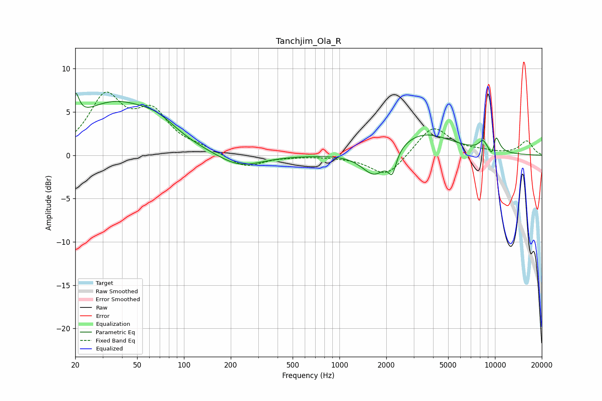

# Tanchjim_Ola_R
See [usage instructions](https://github.com/jaakkopasanen/AutoEq#usage) for more options and info.

### Parametric EQs
Apply preamp of -7.3 dB when using parametric equalizer.

|   # | Type    |   Fc (Hz) |    Q |   Gain (dB) |
|-----|---------|-----------|------|-------------|
|   1 | Peaking |        20 | 5.91 |         3   |
|   2 | Peaking |        35 | 0.55 |         5.8 |
|   3 | Peaking |        68 | 1.16 |         1.5 |
|   4 | Peaking |       227 | 0.99 |        -1.6 |
|   5 | Peaking |      1691 | 1.71 |        -3.1 |
|   6 | Peaking |      2185 | 5.63 |        -2.3 |
|   7 | Peaking |      3362 | 0.73 |         2.7 |
|   8 | Peaking |      8347 | 5.26 |         1   |
|   9 | Peaking |      9669 | 6    |        -2.7 |
|  10 | Peaking |     10000 | 4.88 |         3.2 |

### Fixed Band EQs
When using fixed band (also called graphic) equalizer, apply preamp of **-7.4 dB** (if available) and set gains manually with these parameters.

|   # | Type    |   Fc (Hz) |    Q |   Gain (dB) |
|-----|---------|-----------|------|-------------|
|   1 | Peaking |        31 | 1.41 |         6.4 |
|   2 | Peaking |        62 | 1.41 |         4.4 |
|   3 | Peaking |       125 | 1.41 |         0.6 |
|   4 | Peaking |       250 | 1.41 |        -1.5 |
|   5 | Peaking |       500 | 1.41 |        -0.1 |
|   6 | Peaking |      1000 | 1.41 |        -0.1 |
|   7 | Peaking |      2000 | 1.41 |        -2.5 |
|   8 | Peaking |      4000 | 1.41 |         3.4 |
|   9 | Peaking |      8000 | 1.41 |         0.3 |
|  10 | Peaking |     16000 | 1.41 |         1.6 |

### Graphs

