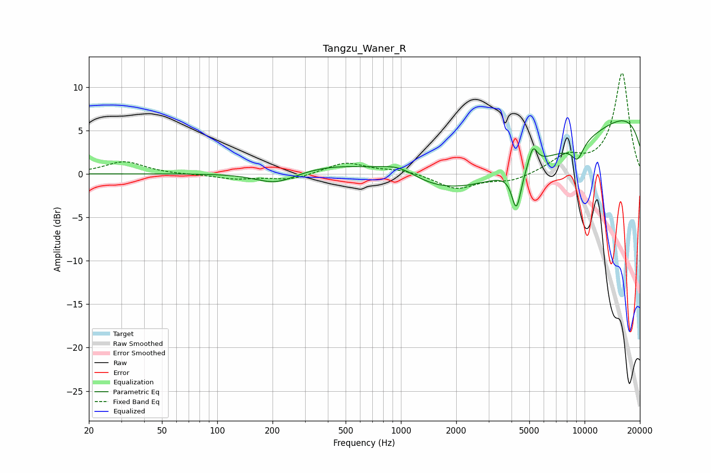

# Tangzu_Waner_R
See [usage instructions](https://github.com/jaakkopasanen/AutoEq#usage) for more options and info.

### Parametric EQs
Apply preamp of -6.2 dB when using parametric equalizer.

|   # | Type    |   Fc (Hz) |    Q |   Gain (dB) |
|-----|---------|-----------|------|-------------|
|   1 | Peaking |       209 | 1.23 |        -1.5 |
|   2 | Peaking |       590 | 0.47 |         2.3 |
|   3 | Peaking |       977 | 1.27 |         1.7 |
|   4 | Peaking |      3867 | 0.21 |        -7.8 |
|   5 | Peaking |      4155 | 5.91 |        -0.5 |
|   6 | Peaking |      4261 | 5.78 |        -3.8 |
|   7 | Peaking |      4489 | 3.72 |        -0.3 |
|   8 | Peaking |      5228 | 5.75 |         2.3 |
|   9 | Peaking |      9147 | 3.75 |        -2   |
|  10 | Peaking |     10000 | 0.18 |         9.8 |

### Fixed Band EQs
When using fixed band (also called graphic) equalizer, apply preamp of **-11.7 dB** (if available) and set gains manually with these parameters.

|   # | Type    |   Fc (Hz) |    Q |   Gain (dB) |
|-----|---------|-----------|------|-------------|
|   1 | Peaking |        31 | 1.41 |         1.4 |
|   2 | Peaking |        62 | 1.41 |        -0.1 |
|   3 | Peaking |       125 | 1.41 |        -0.6 |
|   4 | Peaking |       250 | 1.41 |        -0.7 |
|   5 | Peaking |       500 | 1.41 |         1.3 |
|   6 | Peaking |      1000 | 1.41 |         0.5 |
|   7 | Peaking |      2000 | 1.41 |        -1.7 |
|   8 | Peaking |      4000 | 1.41 |        -0.9 |
|   9 | Peaking |      8000 | 1.41 |         1.8 |
|  10 | Peaking |     16000 | 1.41 |        11.6 |

### Graphs

