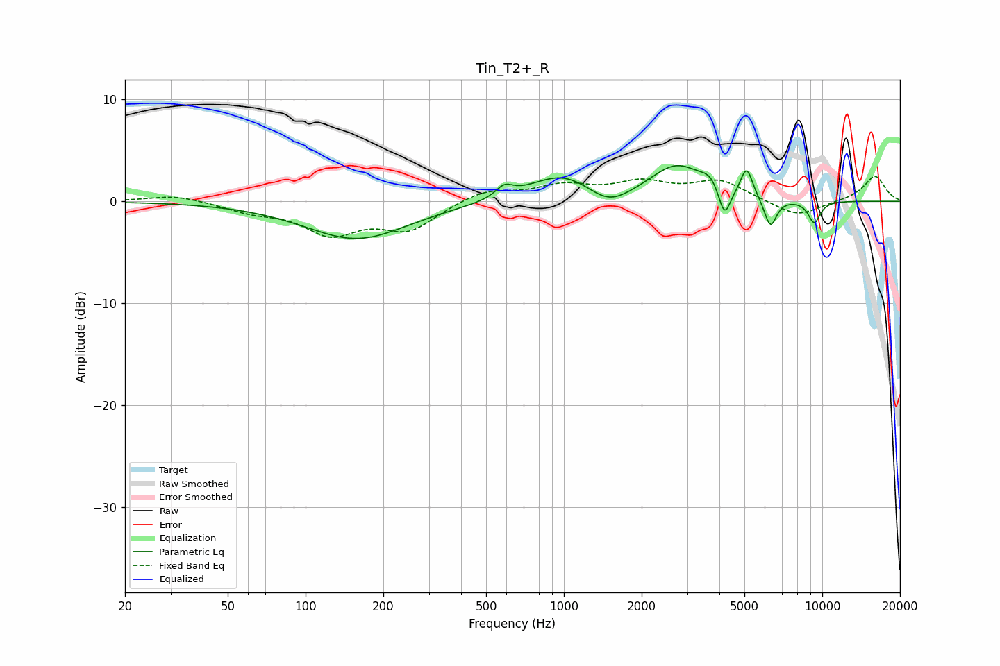

# Tin_T2+_R
See [usage instructions](https://github.com/jaakkopasanen/AutoEq#usage) for more options and info.

### Parametric EQs
Apply preamp of -3.6 dB when using parametric equalizer.

|   # | Type    |   Fc (Hz) |    Q |   Gain (dB) |
|-----|---------|-----------|------|-------------|
|   1 | Peaking |       158 | 0.71 |        -3.7 |
|   2 | Peaking |       588 | 4.31 |         1.1 |
|   3 | Peaking |       988 | 1.09 |         2.7 |
|   4 | Peaking |      1491 | 1.72 |        -1.8 |
|   5 | Peaking |      2734 | 1.37 |         3.4 |
|   6 | Peaking |      3692 | 3.87 |         1.1 |
|   7 | Peaking |      4186 | 6    |        -3   |
|   8 | Peaking |      5099 | 5.95 |         2.9 |
|   9 | Peaking |      6302 | 5.8  |        -2.9 |
|  10 | Peaking |      9315 | 5.34 |        -2.2 |

### Fixed Band EQs
When using fixed band (also called graphic) equalizer, apply preamp of **-2.5 dB** (if available) and set gains manually with these parameters.

|   # | Type    |   Fc (Hz) |    Q |   Gain (dB) |
|-----|---------|-----------|------|-------------|
|   1 | Peaking |        31 | 1.41 |         0.7 |
|   2 | Peaking |        62 | 1.41 |        -0.9 |
|   3 | Peaking |       125 | 1.41 |        -3   |
|   4 | Peaking |       250 | 1.41 |        -2.6 |
|   5 | Peaking |       500 | 1.41 |         1.2 |
|   6 | Peaking |      1000 | 1.41 |         1.4 |
|   7 | Peaking |      2000 | 1.41 |         1.6 |
|   8 | Peaking |      4000 | 1.41 |         1.9 |
|   9 | Peaking |      8000 | 1.41 |        -1.6 |
|  10 | Peaking |     16000 | 1.41 |         2.5 |

### Graphs

