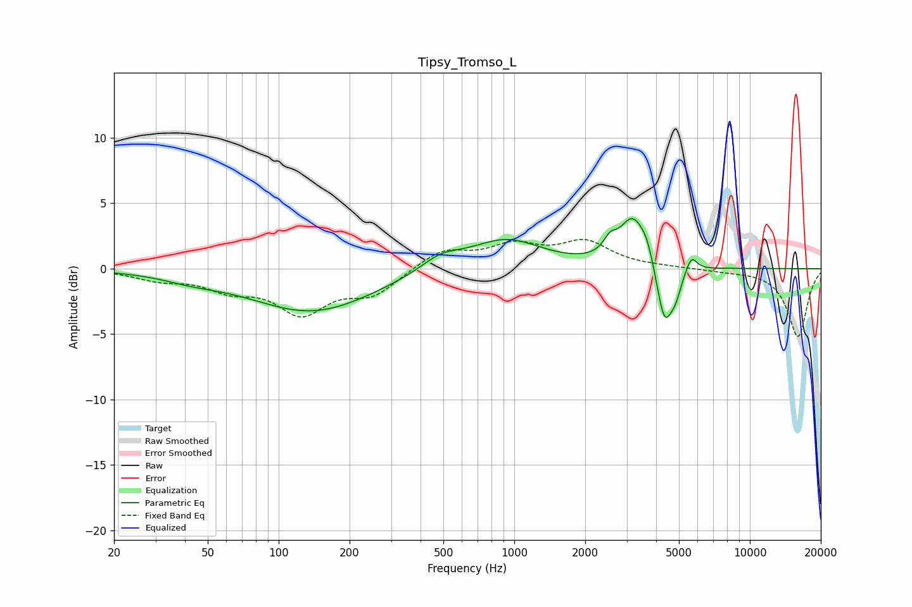

# Tipsy_Tromso_L
See [usage instructions](https://github.com/jaakkopasanen/AutoEq#usage) for more options and info.

### Parametric EQs
Apply preamp of -3.9 dB when using parametric equalizer.

|   # | Type    |   Fc (Hz) |    Q |   Gain (dB) |
|-----|---------|-----------|------|-------------|
|   1 | Peaking |        43 | 1.13 |        -0.5 |
|   2 | Peaking |       139 | 0.54 |        -3.3 |
|   3 | Peaking |       486 | 1.64 |         1   |
|   4 | Peaking |       918 | 0.92 |         2.3 |
|   5 | Peaking |      2549 | 5.13 |         1   |
|   6 | Peaking |      3179 | 2.51 |         3.7 |
|   7 | Peaking |      3666 | 4.55 |         1.1 |
|   8 | Peaking |      4345 | 4.03 |        -4.7 |
|   9 | Peaking |      4853 | 6    |        -1.2 |
|  10 | Peaking |      5647 | 6    |         1.2 |

### Fixed Band EQs
When using fixed band (also called graphic) equalizer, apply preamp of **-2.3 dB** (if available) and set gains manually with these parameters.

|   # | Type    |   Fc (Hz) |    Q |   Gain (dB) |
|-----|---------|-----------|------|-------------|
|   1 | Peaking |        31 | 1.41 |        -0.7 |
|   2 | Peaking |        62 | 1.41 |        -1.3 |
|   3 | Peaking |       125 | 1.41 |        -3.2 |
|   4 | Peaking |       250 | 1.41 |        -1.8 |
|   5 | Peaking |       500 | 1.41 |         1.4 |
|   6 | Peaking |      1000 | 1.41 |         1.6 |
|   7 | Peaking |      2000 | 1.41 |         1.9 |
|   8 | Peaking |      4000 | 1.41 |         0.1 |
|   9 | Peaking |      8000 | 1.41 |        -0.1 |
|  10 | Peaking |     16000 | 1.41 |        -5.2 |

### Graphs

